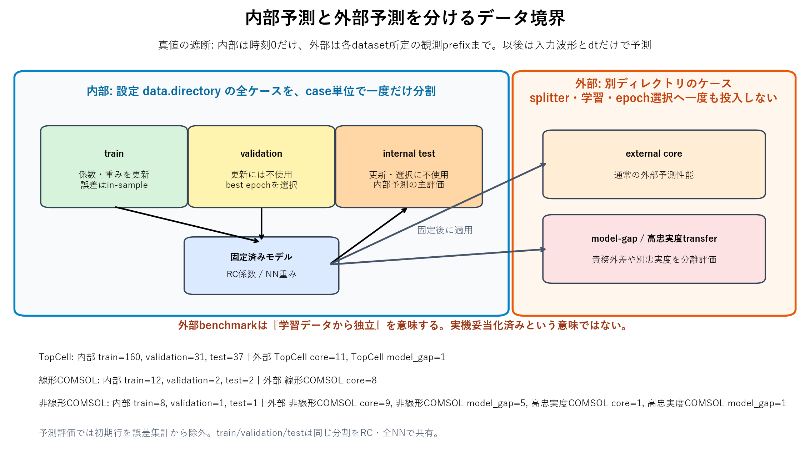

# 物理RCとニューラル時系列モデルの比較

このbenchmarkは、過去に存在したニューラルモデル群を現在の時系列定義へ合わせて再実装し、
現行の物理RCと同じcase split・因果境界で内部／外部予測を比較する評価専用コードです。
product APIへmodel選択optionを増やさず、採用判断に必要な証拠だけを生成します。

現行`src/celltemp`にはこれらの実装は残っていませんが、Git commit `2059618`の
`src/celltemp/models_sequence.py`にMLP、1D-CNN、TCN、GRU、LSTMが存在したことを確認しました。
旧実装をそのままproductへ戻さず、現行の`commands[k]`区間規約・可変`dt`・因果評価へ合わせています。

## 比較するモデル

| model | 履歴の処理 | 学習出力 |
|---|---|---|
| MLP | 8 stepを平坦化して全結合 | sensorごとの`dT/dt` |
| 1D-CNN | 時間方向の局所畳み込み | 同上 |
| TCN | dilation 1/2/4の因果畳み込み | 同上 |
| GRU | gated recurrent stateへ圧縮 | 同上 |
| LSTM | memory cellと3 gateで圧縮 | 同上 |

履歴1行は、train dataだけで標準化した`[sensor temperature, command, log(dt)]`です。
現在区間の`[command, log(dt)]`もqueryとして渡し、出力した物理温度変化率を
`T[k+1] = T[k] + dT/dt * dt[k]`で積分します。学習lossはcase-balanced one-step Huber、
best epochは将来温度を入力しない完全なcausal open-loop validation RMSEで選びます。

`TPU`というmodel classは現行sourceにもGit履歴にもありません。履歴にあった名称は`TCN`であり、
この比較ではTCNを評価しています。TPU hardwareを使った学習も行っておらず、deviceはCPUです。

## 実行

既存のCOMSOL CSVと現行RC artifactを再利用するため、新しいCOMSOL solveは行いません。

```powershell
uv run --locked --with-editable . python -m benchmarks.neural_comparison.run `
  --epochs 300 `
  --output-dir docs/neural_model_comparison
```

乱数seedは42、hidden widthは32、dropoutは0.05、最大300 epochです。TopCell、線形COMSOL、
非線形COMSOLで学習し、非線形COMSOLで学習したmodelはhigh-fidelity COMSOLへ再学習なしで適用します。

## 内部予測と外部予測の境界



| 境界 | dataの所在 | 係数・weight更新 | epoch選択 | 予測時の温度観測 | 役割 |
|---|---|---:|---:|---|---|
| internal train | 設定`data.directory`をcase単位で分割 | 使用 | 不使用 | 時刻0のみ | in-sample診断 |
| internal validation | 同上 | 不使用 | 使用 | 時刻0のみ | best epoch選択 |
| internal test | 同上 | 不使用 | 不使用 | 時刻0のみ | **内部予測の主評価** |
| external | 別の`eval` directory。splitterへ未投入 | 不使用 | 不使用 | dataset所定の観測prefixまで | 独立caseでの外部評価 |

内部評価では全splitについて、時刻0以後の温度をrequestからNaNへ置換してから予測します。したがって、
trainの結果も逐次真値で補正したfit誤差ではなく、初期温度、将来command、`dt`だけによるopen-loop誤差です。
ただしtrainはparameter更新に使ったcaseなので、model採否には使いません。外部benchmarkは学習dataからの
独立性を表すだけで、実機妥当化済みという意味ではありません。正確なdirectory、case ID、利用区分は
[`evaluation_boundaries.csv`](../../docs/neural_model_comparison/evaluation_boundaries.csv)を正本とします。

## 主要結果

### 内部held-out test

同じ設定data集合からcase単位で保留し、係数学習にもepoch選択にも使わなかったtestのcase平均RMSE [K]です。
R²とcase別値は[`internal_summary.csv`](../../docs/neural_model_comparison/internal_summary.csv)と
[`internal_case_metrics.csv`](../../docs/neural_model_comparison/internal_case_metrics.csv)を正本とします。

| 内部test | cases | 物理RC | MLP | 1D-CNN | TCN | GRU | LSTM |
|---|---:|---:|---:|---:|---:|---:|---:|
| TopCell | 37 | **0.019** | 0.343 | 0.199 | 0.551 | 0.113 | 0.164 |
| 線形COMSOL | 2 | **0.027** | 0.087 | 0.072 | 0.169 | 0.132 | 0.125 |
| 非線形COMSOL | 1 | **0.405** | 1.291 | 1.958 | 1.577 | 2.767 | 2.699 |

内部testでも3問題すべてで物理RCが最小でした。非線形COMSOLはvalidation 1 case、test 1 caseしかないため、
この差だけを一般化性能の確定値にはしません。TopCellと線形COMSOLは全モデルでR²が高い一方、RMSEには明確な
差があります。広い温度rangeでR²だけを採用判断に使えない具体例です。

### 外部case

外部core caseのcase平均RMSE [K]です。R²、worst case、case別値は
[`summary.csv`](../../docs/neural_model_comparison/summary.csv)と
[`case_metrics.csv`](../../docs/neural_model_comparison/case_metrics.csv)を正本とします。

| 評価 | 物理RC | MLP | 1D-CNN | TCN | GRU | LSTM |
|---|---:|---:|---:|---:|---:|---:|
| TopCell (11 cases) | **0.143** | 1.520 | 1.317 | 1.868 | 1.372 | 1.955 |
| 線形COMSOL (8 cases) | **0.036** | 0.345 | 0.175 | 0.326 | 0.920 | 0.812 |
| 非線形COMSOL (9 cases) | **0.191** | 1.958 | 1.443 | 1.130 | 1.767 | 1.993 |
| high-fidelity COMSOL (1 core case) | **0.048** | 0.657 | 0.650 | 0.786 | 0.328 | 0.710 |

今回のdata量・最小共通設定では、通常の外部caseでニューラル群を採用する根拠はありません。
非線形COMSOLの放射model-gap 5 casesでは、ニューラル5モデルの平均RMSE 3.504–4.493 Kが物理RC
4.556 Kを下回りました。ただし通常caseの劣化、1 seed、hyperparameter未探索を考えると、coreへ追加する
根拠には不十分です。model-form gapを狙う次の候補は、全面置換より小さなphysics residualです。

## 観測noiseに対する感度

clean dataで学習したmodelを固定し、予測開始までに観測できる温度だけへ独立Gaussian noiseを加えました。
内部testは時刻0だけ、外部coreはdataset所定の観測prefixだけを摂動し、将来のclean truthに対して採点します。
0.15 KはTopCellとCOMSOL monitorの通常sensor noise設定、0.50 Kはstress条件です。正のnoiseは5 realization、
cleanは1回です。この試験は学習labelのnoise、command誤差、parameter不確かさ、未知物理を含みません。

0.15 Kにおけるcase平均RMSE [K]は次の通りです。

| 評価境界 | 物理RC | MLP | 1D-CNN | TCN | GRU | LSTM |
|---|---:|---:|---:|---:|---:|---:|
| TopCell internal test | **0.041** | 0.362 | 0.219 | 0.567 | 0.148 | 0.192 |
| 線形COMSOL internal test | **0.054** | 0.160 | 0.145 | 0.204 | 0.192 | 0.176 |
| 非線形COMSOL internal test | **0.414** | 1.296 | 1.960 | 1.569 | 2.746 | 2.686 |
| TopCell external core | **0.161** | 1.521 | 1.320 | 1.866 | 1.376 | 1.957 |
| 線形COMSOL external core | **0.057** | 0.377 | 0.208 | 0.348 | 0.947 | 0.841 |
| 非線形COMSOL external core | **0.189** | 1.971 | 1.450 | 1.130 | 1.770 | 2.006 |
| high-fidelity COMSOL external core | **0.090** | 0.684 | 0.685 | 0.803 | 0.372 | 0.732 |

この範囲では物理RCが全境界で最小です。ただし非線形internal / externalの一部でnoise平均がcleanより僅かに
小さくなるのは、1 caseまたは有限5 realizationで誤差が偶然相殺されたためであり、noiseが精度を改善したとは
解釈しません。0.50 Kを含む全case・全realizationは`noise_case_metrics.csv`、集計は`noise_summary.csv`を
正本とします。

## 物理RCの未知項リスク

通常caseの低RMSEは、選んだRC topologyと法則が適用範囲内で有効だった証拠です。未モデル化項が係数へ吸収され、
学習範囲内だけ低誤差になる可能性は残ります。既知のmodel-gapを別枠で与えると、物理RCのcase平均RMSEは
TopCellの温度依存熱損失で0.143 Kから9.823 K（68.7倍）、非線形COMSOLの表面間放射で0.191 Kから
4.556 K（23.9倍）、high-fidelity放射caseで0.048 Kから0.144 K（3.0倍）へ増えます。

したがって、fitted coefficientを未知物理の存在しない「真の物性」とは扱いません。またopen-loop forecastは
将来発生する未指令発熱を事前に予測できません。online observerは新しい観測が到着した後に、設定したunknown-heat
basis上でのみ外乱を推定できます。basis外の発熱分布、sensor配置の不足、sensor biasとの非識別性があれば、状態・
外乱・biasの間で誤帰属し得ます。noise robustnessとmodel-form adequacyは別の合否条件として維持します。

## 出力

- `docs/neural_model_comparison/evaluation_boundaries.csv`: 内部／外部のdirectory、case、学習利用区分
- `internal_summary.csv`: train / validation / held-out test × modelの要約
- `internal_case_metrics.csv`: 内部全splitのcase別RMSE、MAE、最大誤差
- `internal_test_prediction_points.csv`: 内部test波形・parity図の元data
- `summary.csv`: 外部評価境界 × modelの要約
- `case_metrics.csv`: 外部case別RMSE、MAE、最大誤差
- `prediction_points.csv`: 外部波形・parity図の元data
- `training_history.csv`: causal open-loop validation履歴
- `training_summary.csv`: best epoch、parameter数、学習時間
- `docs/validation_figures/00_internal_external_definition.png`: 内部／外部を分けるdata flow
- `docs/validation_figures/01_external_rmse_overview.png`: RCとの外部RMSE比較
- `docs/validation_figures/02_training_validation_history.png`: 学習が進んだことを示す検証曲線
- `docs/validation_figures/08_internal_rmse_by_split.png`: train / validation / testのopen-loop誤差
- `docs/validation_figures/09–11_*_internal_test_timeseries.png`: 内部testの真値–予測時系列
- `docs/validation_figures/09–11_*_internal_test_parity.png`: 内部test全点の真値–予測とR²
- `docs/validation_figures/12_internal_test_vs_external_core.png`: 内部testと外部coreを混ぜない並列比較
- `noise_case_metrics.csv`: 観測noiseのcase・realization別RMSE、MAE、最大誤差
- `noise_summary.csv`: 観測noise標準偏差ごとの平均、反復分散、worst、clean比
- `rc_model_gap_summary.csv`: 物理RCの通常coreと既知model-gapの対比較
- `docs/validation_figures/13_observation_noise_sensitivity.png`: 内部test・外部coreの観測noise感度
- `docs/validation_figures/14_rc_unknown_physics_risk.png`: 通常性能と未知物理caseの物理RC誤差差
- `docs/validation_figures/03–06_*`: 外部caseの時系列とparity図
- `docs/validation_figures/07_model_gap_rmse.png`: 通常性能と混ぜないmodel-gap比較

学習済みweightは再現用に`benchmarks/neural_comparison/work/`へ保存しますが、派生物なのでGit管理外です。

## 解釈上の限界

- これはarchitecture screeningであり、各modelを大規模探索した最終順位ではありません。
- 1 seedだけなので、ニューラルmodelの分散はまだ評価していません。
- RCは全trajectory loss、ニューラル群はone-step lossで学習し、双方を同じopen-loop外部予測で評価します。
- 内部testと外部coreはcase集合と観測prefixが異なるため、数値差を「外部は常に難しい」と読み替えません。
- high-fidelity結果はCAEや実機の資格合格を意味しません。
- 観測noise試験はclean学習済みmodelの推論時感度であり、noisy dataでの再学習耐性ではありません。
- 予測区間はmeasurement、parameter、future-input、model-form uncertaintyを含みません。
- model追加は、複数seed、worst case、長期安定性、外挿でRCを上回った場合だけ再検討します。
