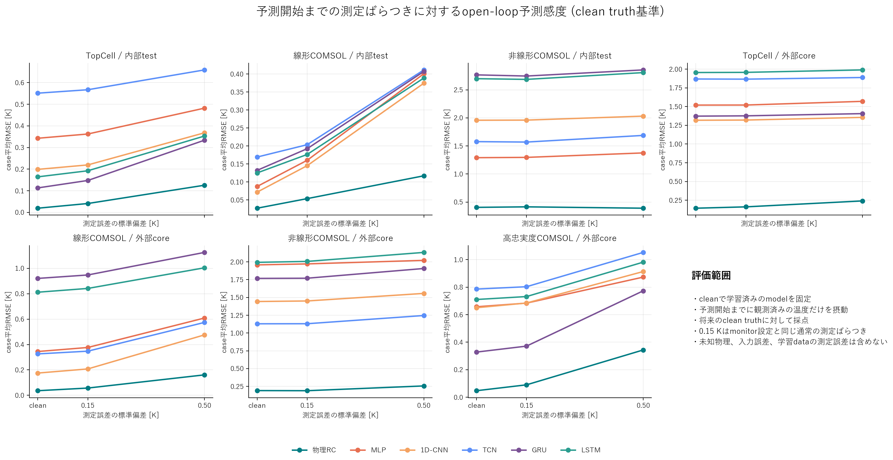
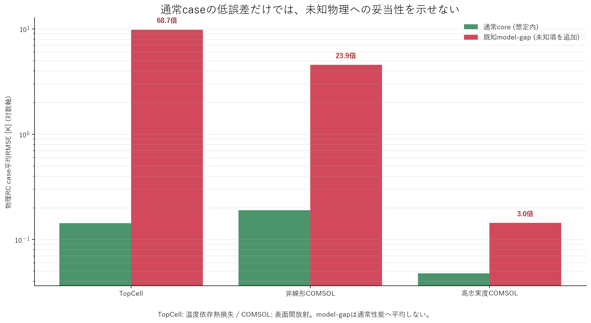

# Benchmark evidence

この文書は、用途の異なるbenchmarkを一つの点数へ混ぜず、現在の証拠と利用限界を読むための索引です。
数値の正本は各workflowが出力するJSON/CSVであり、この文書は2026-10-01時点の要約です。外部report
builderや別の集計schemaは設けません。

入熱位置、冷却境界、計測領域、各評価で使用したモデル、COMSOL `.mph`の所在は、先に
[problem setup figures](benchmark_problem_setups.md)で確認できます。

## 最初に区別すること

- quickstartは公開workflowの動作確認であり、独立benchmarkではない。
- TopCellは合成truthに対する回帰・外部case・monitorのproduct benchmarkである。
- 線形COMSOLは単純化した固体伝熱と一定対流に対するscreeningである。
- 非線形COMSOLは共役熱流動、流速依存、放射によるmodel-form gapを調べる外部評価である。
- high-fidelity COMSOLのworkflow合格は、mesh・時間刻み・実験の厳格資格を意味しない。
- RMSEは各行のcase集合内でbaselineと比較する。異なる行のRMSEをdata難易度を無視して順位付けしない。

## Open-loop予測の現在値

すべてcase平均RMSEです。`worst`はfitted RCのcase別最大値です。将来truthは予測入力へ渡していません。
metric originは既存benchmarkの定義を維持し、TopCell外部は推定originを含め、COMSOL外部は初期化行を
除外します。下記の内部比較は全問題で時刻0を初期条件として誤差から除外します。

| 評価境界 | cases | fitted RC [K] | engineering prior [K] | persistence [K] | worst [K] | 判定 |
|---|---:|---:|---:|---:|---:|---|
| quickstart test | 6 | 0.894 | 3.660 | 2.081 | 1.105 | workflow smokeのみ |
| TopCell external core | 11 | 0.143 | 7.185 | 43.551 | 1.303 | 15/15 checks合格 |
| 線形COMSOL external forecast | 8 | 0.036 | 7.362 | 17.496 | 0.083 | 11/11 checks合格 |
| 非線形COMSOL、放射なし | 9 | 0.191 | 15.849 | 30.401 | 0.503 | workflow合格、screeningのみ |
| 非線形COMSOL、放射model gap | 5 | 4.556 | 10.816 | 28.260 | 9.412 | gapを明示、通常性能へ平均しない |
| high-fidelity local-medium | 2 | 0.096 | 0.889 | 9.953 | 0.144 | workflow合格、厳格資格は未達 |

TopCellの別枠negative controlは温度依存熱損失を持ち、fitted RCのRMSEは9.823 Kです。これは通常caseの
失敗として平均せず、線形RCの適用外を検出できることの証拠にします。非線形COMSOLでも放射caseだけ誤差が
大きく、単一の3-node RCが放射効果を一般化できていません。

## 内部予測と外部予測の境界

- **内部**は各configの`data.directory`へ入ったcase集合です。一度だけcase単位でtrain / validation / testへ
  分割し、testは係数・weight更新にもbest epoch選択にも使いません。
- **外部**は別のevaluation directoryにあるcaseです。splitter、学習、model選択へ一度も渡しません。
- 内部の全splitは、時刻0の温度だけを残し、以後の真値をrequestから除去してopen-loop予測します。
  train結果はin-sample診断、validationはmodel選択、**held-out testだけが内部予測の主結果**です。
- 外部はdatasetが定義した観測prefixまでを初期化に使います。内部testとcase集合・originが異なるため、
  両者の差をそのままdata難易度の順位にはしません。
- 「外部」は学習dataから独立という意味であり、実機妥当化済みという意味ではありません。

実際の内部分割はTopCell 160/31/37、線形COMSOL 12/2/2、非線形COMSOL 8/1/1です。全case ID、
source directory、学習利用flagは
[`evaluation_boundaries.csv`](neural_model_comparison/evaluation_boundaries.csv)に固定しました。

## ニューラル時系列modelとの同条件比較

MLP、1D-CNN、TCN、GRU、LSTMを、現行RCと同じcase split・forecast origin・外部caseで学習・評価しました。
8 stepの温度・command・`dt`履歴からsensorごとの`dT/dt`を学習し、将来truthを使わず自己回帰します。
数値は300 epoch上限、seed 42のcase平均RMSE [K]です。

| 内部held-out test | cases | fitted RC | MLP | 1D-CNN | TCN | GRU | LSTM |
|---|---:|---:|---:|---:|---:|---:|---:|
| TopCell | 37 | **0.019** | 0.343 | 0.199 | 0.551 | 0.113 | 0.164 |
| 線形COMSOL | 2 | **0.027** | 0.087 | 0.072 | 0.169 | 0.132 | 0.125 |
| 非線形COMSOL | 1 | **0.405** | 1.291 | 1.958 | 1.577 | 2.767 | 2.699 |

| 外部core評価 | fitted RC | MLP | 1D-CNN | TCN | GRU | LSTM |
|---|---:|---:|---:|---:|---:|---:|
| TopCell、11 cases | **0.143** | 1.520 | 1.317 | 1.868 | 1.372 | 1.955 |
| 線形COMSOL、8 cases | **0.036** | 0.345 | 0.175 | 0.326 | 0.920 | 0.812 |
| 非線形COMSOL、9 cases | **0.191** | 1.958 | 1.443 | 1.130 | 1.767 | 1.993 |
| high-fidelity COMSOL、1 core case | **0.048** | 0.657 | 0.650 | 0.786 | 0.328 | 0.710 |

内部testの3問題と外部coreの全境界でRCが最良でした。非線形COMSOLの放射model-gap 5 casesではニューラル5モデルの
平均RMSE 3.504–4.493 KがRC 4.556 Kを下回りますが、通常caseの劣化と1 seedという制約からproduct採用の
証拠にはしません。比較はarchitecture screeningであり、ニューラルmodel一般の否定でも最終hyperparameter順位でも
ありません。波形、R²、学習曲線、元CSVは[neural model comparison](neural_model_comparison/)を正本とします。
実装・再実行条件は[benchmark README](../benchmarks/neural_comparison/README.md)に固定しました。

## 観測noiseと未知物理は別に判定する

cleanで学習済みのmodelを固定し、予測開始までの観測温度だけへGaussian noiseを追加しました。内部testは時刻0、
外部coreはdataset所定の観測prefixを摂動し、将来のclean truthへ採点しています。0.15 Kは既存monitor設定と同じ
通常noise、0.50 Kはstress条件で、各5 realizationです。0.15 Kのcase平均RMSE [K]は以下です。

| 評価境界 | fitted RC | MLP | 1D-CNN | TCN | GRU | LSTM |
|---|---:|---:|---:|---:|---:|---:|
| TopCell internal test | **0.041** | 0.362 | 0.219 | 0.567 | 0.148 | 0.192 |
| 線形COMSOL internal test | **0.054** | 0.160 | 0.145 | 0.204 | 0.192 | 0.176 |
| 非線形COMSOL internal test | **0.414** | 1.296 | 1.960 | 1.569 | 2.746 | 2.686 |
| TopCell external core | **0.161** | 1.521 | 1.320 | 1.866 | 1.376 | 1.957 |
| 線形COMSOL external core | **0.057** | 0.377 | 0.208 | 0.348 | 0.947 | 0.841 |
| 非線形COMSOL external core | **0.189** | 1.971 | 1.450 | 1.130 | 1.770 | 2.006 |
| high-fidelity external core | **0.090** | 0.684 | 0.685 | 0.803 | 0.372 | 0.732 |

物理RCは全境界で最小ですが、これは観測noiseへの推論時感度だけです。学習labelのnoise、command誤差、parameter
不確かさ、reference truthのnoise、model-form uncertaintyはこの数値に入りません。非線形の一部でnoise平均がclean
より僅かに小さい値は、少数case・有限realizationでの偶然の誤差相殺であり、改善とは解釈しません。全値は
[`noise_summary.csv`](neural_model_comparison/noise_summary.csv)、case別値は
[`noise_case_metrics.csv`](neural_model_comparison/noise_case_metrics.csv)を正本とします。

連続観測を同化するmonitorは別評価です。既存の0.15 K noise-onlyケースでは、TopCellのraw measurement RMSE
0.147 Kに対してposterior physical RMSE 0.067 K、線形COMSOLは0.154 Kに対して0.051 Kでした。これは新観測で
逐次補正できるobserverの結果で、将来観測を使わないopen-loop forecastやニューラルmodelの結果ではありません。

未知項の危険性はnoise試験よりmodel-gap試験に現れます。物理RCの通常coreからmodel-gapへの平均RMSE増加は、
TopCell温度依存熱損失で68.7倍（0.143 -> 9.823 K）、非線形COMSOL表面間放射で23.9倍
（0.191 -> 4.556 K）、high-fidelity放射caseで3.0倍（0.048 -> 0.144 K）です。したがって、通常caseの
低誤差やfitted coefficientの近さを「未知物理がない」「係数が真の物性」「適用外でも安全」と読み替えません。
対比較の正本は[`rc_model_gap_summary.csv`](neural_model_comparison/rc_model_gap_summary.csv)です。

さらに未指令発熱はopen-loopで事前予測できません。online observerは新観測の到着後に、設定したdisturbance basis
上でだけ推定します。TopCell M05は1 sで検出しpeak推定0.757 W、posterior physical RMSE 0.210 K、線形COMSOL
M05は3 W注入を10 sで検出しpeak推定3.182 W、posterior physical RMSE 0.148 Kでした。しかしbasis外の発熱分布、
sensor不足、sensor biasとの非識別性では誤帰属し得るため、これは任意の未知項を回復できる証拠ではありません。

## Monitorの現在値

- TopCellはnoise、slow drift、sensor step、14.5%欠測、未モデル化熱負荷の5ケースを評価し、15/15 checks
  に含まれるmonitor条件を満たします。最大検出遅れは1 sです。
- 線形COMSOLは5ケースを評価します。sensor offsetは0 s、3 W未指令発熱は10 sで検出し、推定peakは
  3.182 Wです。欠測中posterior RMSEは0.040 Kで、11/11 checksを満たします。
- observerは予測modelの優劣比較へ混ぜません。観測同化、欠測継続、未知熱とsensor biasの分離が必要な
  設備だけで使用します。

## CAE品質と利用可能範囲

| 証拠 | 現在の状態 | 許される解釈 |
|---|---|---|
| global-8非線形CAE | mesh・時間刻み・実験は未資格 | 広いcaseでのmodel-form screening |
| local-medium high-fidelity mesh | benchmark基準は合格、strict基準は未合格 | volume-averageのmodel比較 |
| high-fidelity benchmark | mean 0.096 K、worst 0.144 K | fitted RCがbaselineを上回ること |
| model error対mesh差 | `not_resolved_beyond_mesh_difference` | model誤差をmesh誤差より小さいと断定しない |
| BDF最大刻み2 s / 1 s | 8 quantity中4項目が不合格 | 時間離散化は未資格 |
| 実験比較 | 実測値未提供 | 実機精度を主張しない |

2 s / 1 s比較では、chip・base・fins平均温度差が0.080–0.0815 Kで0.05 K基準を超え、放射熱量差も
0.858%で0.5%基準を超えました。最高温度、出口温度、圧力損失は合格しています。0.5 s solveは後日実施
とし、現在の正本は2 s / 1 s比較、`temporal_qualified=false`です。

## 現時点のmodel判断

1. fitted physical RCを、試験済みの非放射範囲における高速・解釈可能な主modelとして維持する。
2. engineering priorとpersistenceは削除せず、学習効果と最低性能を測るbaselineに限定する。
3. 5種類のニューラル時系列modelを同条件評価したが外部coreでRCを上回らないため、product APIへ追加しない。
   放射gapでの局所改善は残すが、high-fidelity差と複数seedが未確定なので採用根拠にしない。
4. 追加modelは、同じsplit・causal horizon・baseline・worst case・peak指標でRCを再現よく上回る場合だけ
   採用する。

## 数値の正本と再実行

| 評価 | 正本 | 再実行 |
|---|---|---|
| quickstart | `examples/topcell_quickstart/work/outputs/runs/thermal_network_demo/metrics_summary.json`、同directoryの`model_comparison.csv` | `celltemp train --config examples/topcell_quickstart/config.yaml` |
| TopCell | `benchmarks/topcell/work/outputs/benchmark/benchmark_summary.json`、同directoryの`model_comparison.csv` | `python -m benchmarks.topcell.run` |
| 線形COMSOL | `external_tools/comsol_chip_cooling/work/evaluation/summary.json`、同directoryの`model_comparison.csv` | COMSOL READMEの`train -> forecast -> monitor -> evaluate` |
| 非線形COMSOL | [`summary.json`](../external_tools/comsol_chip_cooling/data/nonlinear/benchmark/summary.json)、[`model_comparison.csv`](../external_tools/comsol_chip_cooling/data/nonlinear/benchmark/model_comparison.csv) | `python -m external_tools.comsol_chip_cooling.benchmark_nonlinear` |
| high-fidelity | [`summary.json`](../external_tools/comsol_chip_cooling/data/nonlinear_high_fidelity/benchmark/summary.json)、[`model_comparison.csv`](../external_tools/comsol_chip_cooling/data/nonlinear_high_fidelity/benchmark/model_comparison.csv) | `python -m external_tools.comsol_chip_cooling.benchmark_high_fidelity` |
| RC–ニューラル比較 | 内部: [`internal_summary.csv`](neural_model_comparison/internal_summary.csv)、外部: [`summary.csv`](neural_model_comparison/summary.csv)、境界: [`evaluation_boundaries.csv`](neural_model_comparison/evaluation_boundaries.csv) | `python -m benchmarks.neural_comparison.run --epochs 300` |
| 観測noise / RC model-gap | [`noise_summary.csv`](neural_model_comparison/noise_summary.csv)、[`rc_model_gap_summary.csv`](neural_model_comparison/rc_model_gap_summary.csv) | RC–ニューラル比較と同じcommand |
| CAE資格 | [`quality_summary.json`](../external_tools/comsol_chip_cooling/data/nonlinear_high_fidelity/quality_summary.json)、[`time_step_convergence.csv`](../external_tools/comsol_chip_cooling/data/nonlinear_high_fidelity/time_step_convergence.csv) | 専用mesh・time-step・experiment workflow |

## 予測図の読み方

各benchmarkは`figures/*prediction_timeseries.png`と`figures/*prediction_parity.png`を出力します。
時系列図は、評価対象内でfitted RCのRMSEが最大だったcaseを恣意的に選ばず表示し、全sensorについて真値と
因果open-loop予測を重ねます。散布図はforecast originを除く全case・全sensorを用い、同一軸、`y=x`線、
pooled R²、評価点数を示します。放射model gapは通常caseへ混ぜず別図にします。

R²は温度範囲が広いほど高くなり得るため、学習成功の唯一の条件ではありません。時間ずれ、peak、過渡形状は
時系列図で確認し、case別RMSEとbaseline比較は各`model_comparison.csv`を正とします。

コマンドはrepository rootから`uv run --locked --with-editable .`を先頭に付けて実行します。詳細な入力条件と
再生成範囲は各benchmark READMEを正とします。

`work/`以下は再生成物でGit管理しません。tracked benchmark dataはcase/sensor表、baseline比較、残差、品質状態を
再計算可能な形で保持し、派生Markdown reportやpresentationを正本にしません。
