# Benchmark problem setups

このページは、予測精度図を読む前に必要な「どこへ入熱し、何を冷却し、どこを計測し、どのモデルを
評価したか」を図で示します。赤は入熱、青は冷却・流れ、水色の円は温度計測、紫破線は放射です。

各modelへ渡す特徴量、RC方程式、学習parameter、学習処理、forecast / monitor architecture、評価専用の
ニューラル5モデルとの違いは [学習手法・物理モデルの理解ガイド](model_methods_explained.md) にまとめています。

## 画像生成による統合説明図

以下は、問題設定・データセット・評価方法を一続きで読める科学イラストです。理解用の概念図であり、
寸法・mesh・波形・数値の正本は各YAML、CSV、COMSOL raw tableと後段の定義対応模式図です。

### TopCell: 入熱・冷却・4領域計測から予測まで

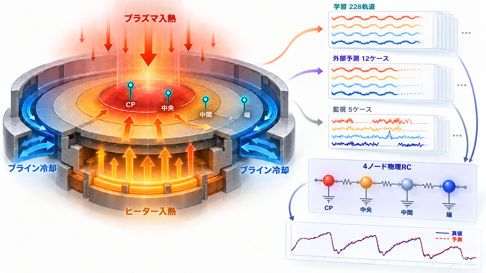

### 線形COMSOL: chip発熱・一定対流・3領域平均

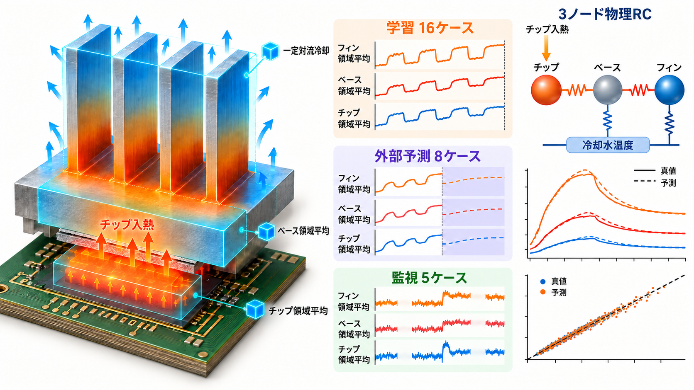

### 非線形COMSOL: 共役熱流動と放射model gap

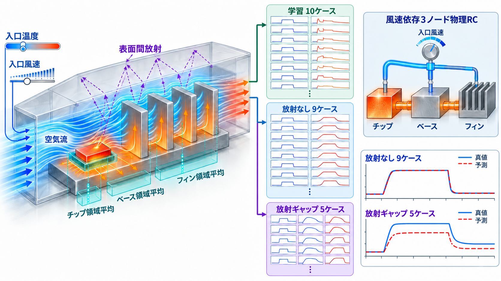

### High-fidelity COMSOL: 局所meshとno-refit外部評価

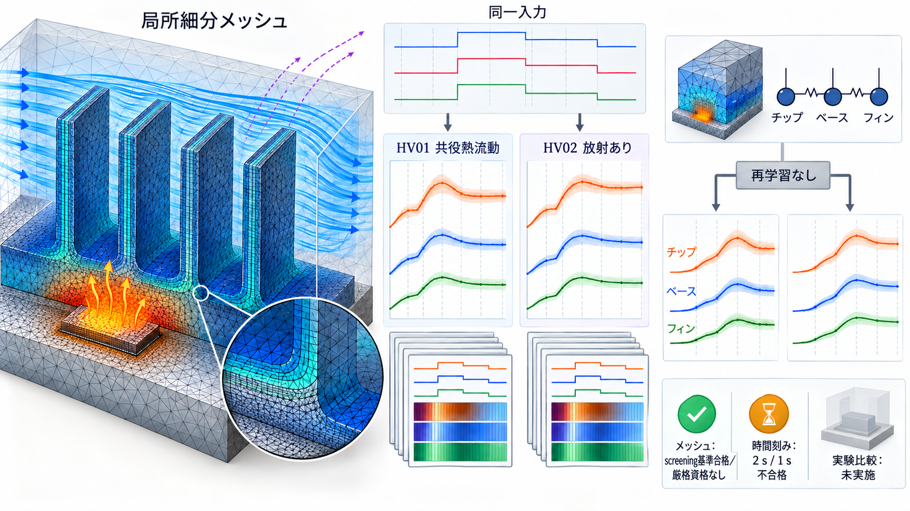

### 共通データセット・学習・forecast・monitor方法

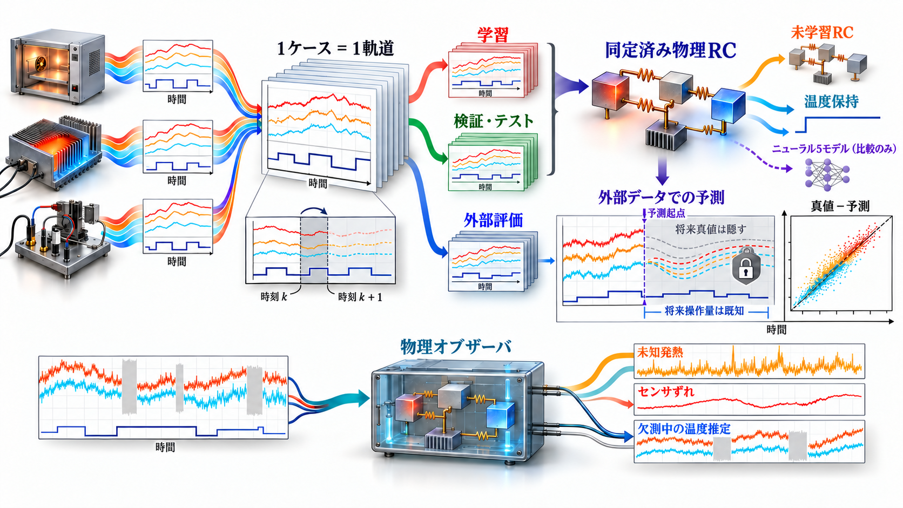

## 定義ファイルと対応する模式図

### TopCell / quickstart

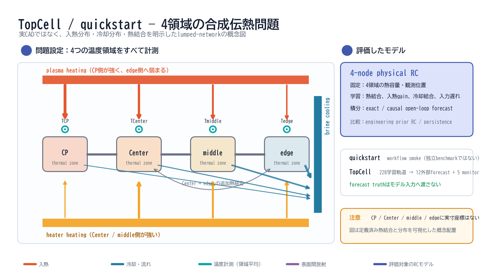

[SVG](figures/benchmark_setups/01_topcell_problem_setup.svg) · 正本設定:
[`examples/topcell_quickstart/system.yaml`](../examples/topcell_quickstart/system.yaml) / [`benchmarks/topcell/system.yaml`](../benchmarks/topcell/system.yaml)

### 線形COMSOL

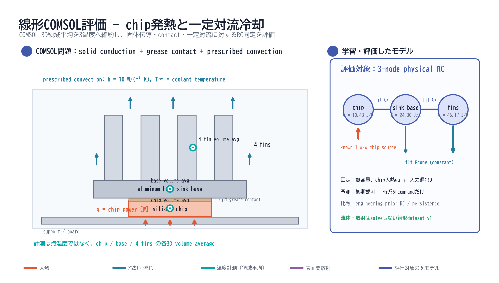

[SVG](figures/benchmark_setups/02_linear_comsol_problem_setup.svg) · 正本定義:
[`problem_definition.md`](../external_tools/comsol_chip_cooling/docs/problem_definition.md) / [`system.yaml`](../external_tools/comsol_chip_cooling/system.yaml)

### 非線形COMSOL

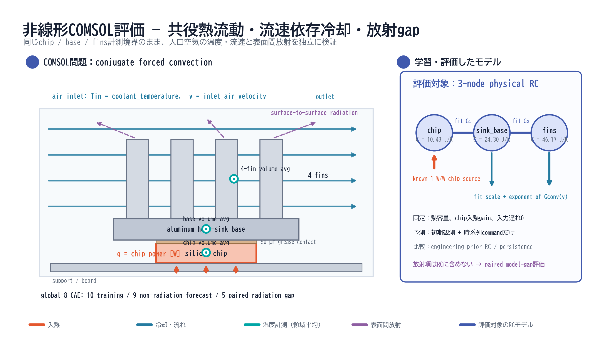

[SVG](figures/benchmark_setups/03_nonlinear_comsol_problem_setup.svg) · 正本定義:
[`nonlinear_problem_definition.md`](../external_tools/comsol_chip_cooling/docs/nonlinear_problem_definition.md) / [`system_nonlinear.yaml`](../external_tools/comsol_chip_cooling/system_nonlinear.yaml)

### High-fidelity COMSOL

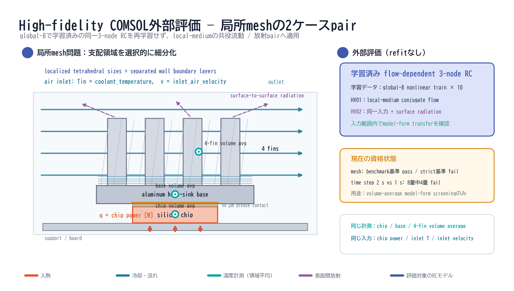

[SVG](figures/benchmark_setups/04_high_fidelity_comsol_problem_setup.svg) · 正本定義:
[`high_fidelity_validation.md`](../external_tools/comsol_chip_cooling/docs/high_fidelity_validation.md)

### 評価ごとの使用モデル

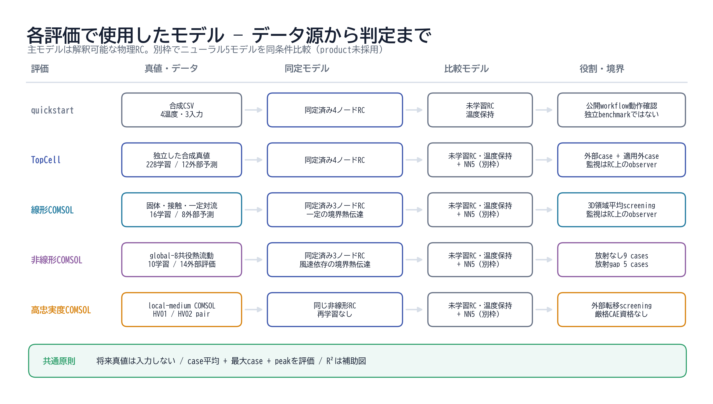

[SVG](figures/benchmark_setups/05_evaluation_model_map.svg)

通常のproduct benchmarkの主評価はfitted physical RC、比較対象は未学習engineering-prior RCと
persistenceです。これとは別に、同じ外部予測境界でMLP、1D-CNN、TCN、GRU、LSTMを評価しました。
tree modelとGaussian processは含みません。TopCellと線形COMSOLのmonitorだけ、fitted RC上の拡張状態
Kalman observerを用いて未知熱・sensor bias・欠測時の物理状態を推定します。

### COMSOL原本・作業コピー・評価CSVの所在

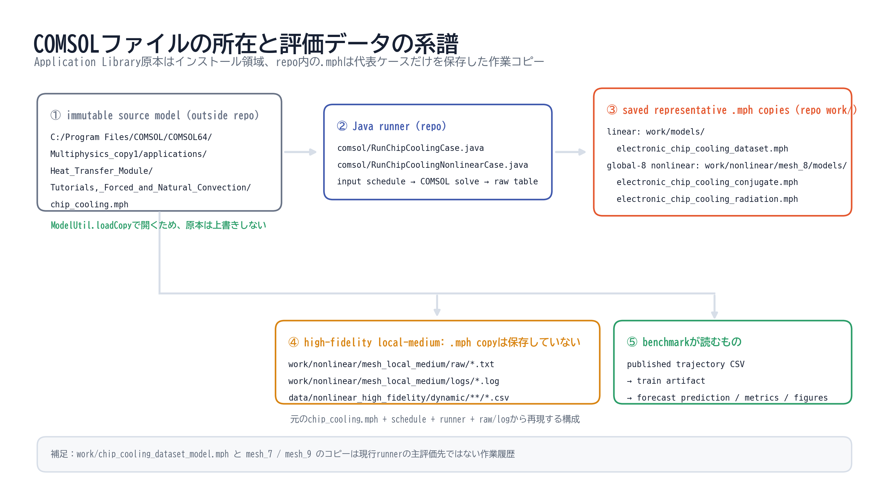

[SVG](figures/benchmark_setups/06_comsol_file_lineage.svg)

現在のホストではApplication Library原本を次から`ModelUtil.loadCopy`で開きます。

```text
C:\Program Files\COMSOL\COMSOL64\Multiphysics_copy1\applications\
  Heat_Transfer_Module\Tutorials,_Forced_and_Natural_Convection\chip_cooling.mph
```

repo内で現在の評価に対応する代表的な保存済み作業コピーは次です。

```text
external_tools/comsol_chip_cooling/work/models/electronic_chip_cooling_dataset.mph
external_tools/comsol_chip_cooling/work/nonlinear/mesh_8/models/electronic_chip_cooling_conjugate.mph
external_tools/comsol_chip_cooling/work/nonlinear/mesh_8/models/electronic_chip_cooling_radiation.mph
```

high-fidelity local-medium実行は代表`.mph`コピーを保存していません。solver証拠は
`work/nonlinear/mesh_local_medium/raw/*.txt`と`logs/*.log`、評価用正本は
`data/nonlinear_high_fidelity/dynamic/**/*.csv`です。benchmarkは`.mph`を直接読み込まず、公開trajectory
CSVを学習・予測に使用します。

図は次で再生成します。これはCOMSOL solve、学習、評価、report生成を行わない静的な図生成だけです。

```powershell
uv run --locked --with-editable . python docs/figures/benchmark_setups/generate.py
```
