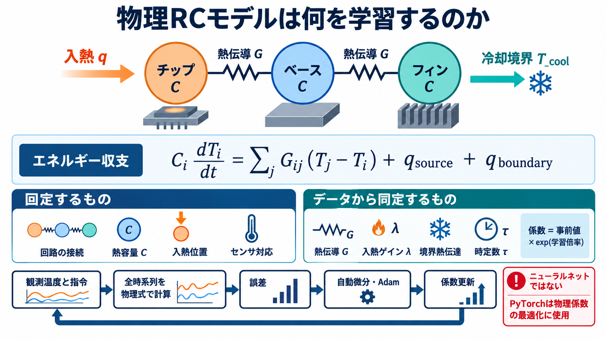
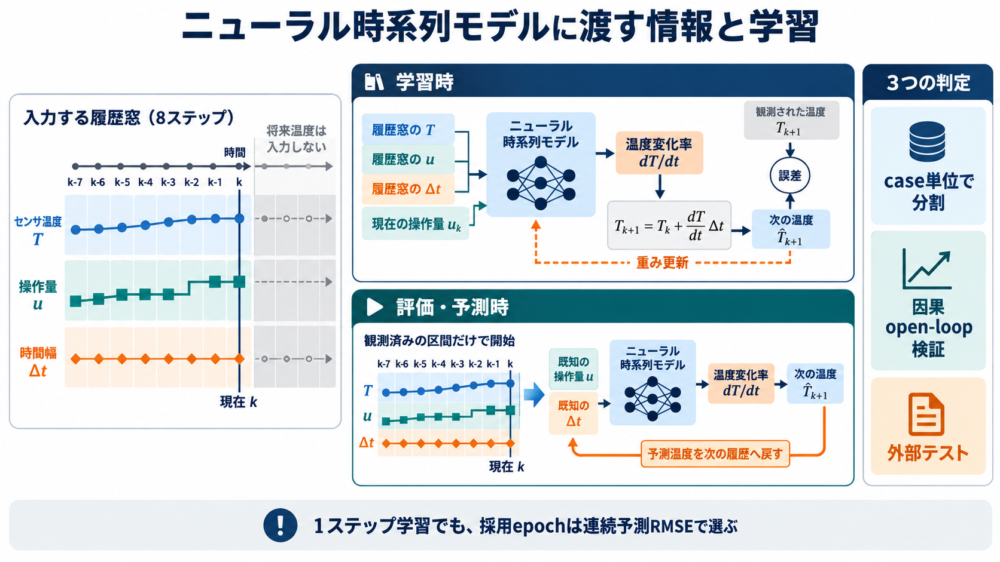
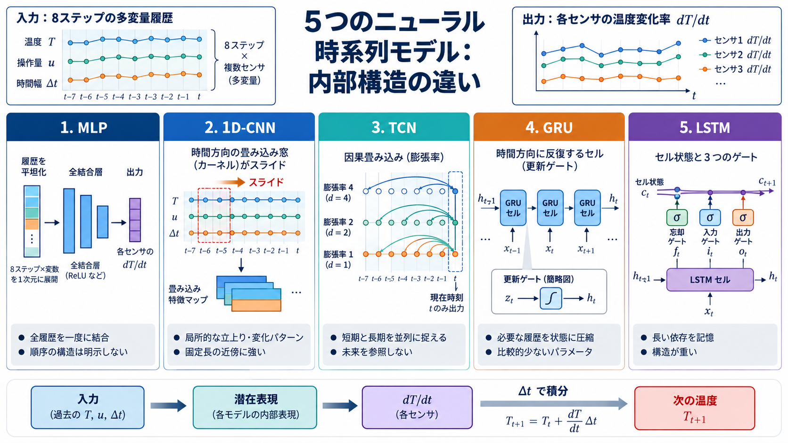
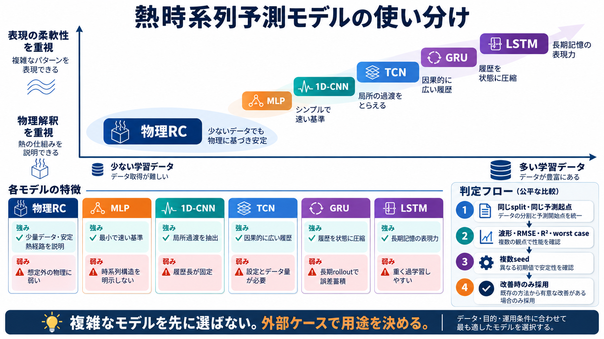

# 学習手法・物理モデルの理解ガイド

この文書は、現在のbenchmarkで実際に使った物理RCと評価専用ニューラルmodelを分けたうえで、
「モデルへ何を渡し、何を学習し、なぜ効果が見込め、どこで破綻し得るか」を説明します。
問題の入熱位置、冷却境界、計測領域は先に
[benchmark problem setups](benchmark_problem_setups.md)、数値結果は
[benchmark evidence](benchmark_evidence.md)を参照してください。

> **重要:** productの主modelである`ThermalRCModel`はニューラルネットではありません。PyTorchの
> `nn.Module`と自動微分は、仮定した熱回路の物理係数を同定するために使います。MLP、1D-CNN、TCN、GRU、
> LSTMは公平な採否判断のため`benchmarks/neural_comparison`へ評価専用で実装しましたが、現時点では
> product APIへ追加していません。`TPU`というmodelはsourceにも履歴にもなく、名称が近いTCNを評価しています。

## 1. 現在評価している手法

| 手法 | 現在の位置づけ | 学習するもの | 主な用途 |
|---|---|---|---|
| fitted physical RC | 主model | 許可された熱伝導率、熱源gain、境界熱伝達、actuator時定数 | 同定、open-loop予測、熱経路解析 |
| engineering-prior RC | baseline | なし。YAMLの工学初期値をそのまま使用 | 学習に価値があったかの比較 |
| persistence | baseline | なし。最後の温度を保持 | 「何も変化しない」予測との比較 |
| physical observer | fitted RCの運用機能 | RC係数は再学習しない。時々刻々の状態を推定 | 欠測、未知発熱、sensor biasの監視 |
| MLP / 1D-CNN / TCN / GRU / LSTM | **benchmark評価のみ** | network weight | RCに対するarchitecture screening |

observerは別の予測modelではありません。学習済みRCを状態遷移に使い、観測が来るたびに状態を補正する
運用方式です。このため、open-loop予測modelの順位へobserver精度を混ぜません。

## 2. 入力特徴と時系列の境界

共通の1 caseは、独立な1-step行の集合ではなく、次の一つのtrajectoryです。

```text
time             [N]
temperature      [N, n_sensor]
commands         [N-1, n_control]
observation_mask [N, n_sensor]
dt = diff(time)  [N-1]
```

`commands[k]`は`[time[k], time[k+1])`へ作用します。可変`dt`はそのまま積分へ渡し、固定刻みへの
resampleは行いません。温度の扱いは通常の表形式MLの「説明変数」と少し異なります。

- 物理RCは`temperature[0]`から開始し、全trajectoryを`commands`と`dt`でrolloutして観測温度を教師にします。
- ニューラル群は8 stepの`[sensor temperature, command, log(dt)]`から、次区間の標準化した`dT/dt`を
  one-step教師として学習します。評価時は予測温度を次の履歴へ戻してopen-loopでrolloutします。
- 両者ともcase単位でtrain / validation / testへsplitします。内部評価は全splitで時刻0の温度だけを残し、
  以後は将来`commands`と`dt`だけで最後まで予測します。将来温度真値はfeature、初期化、更新へ渡しません。
- 外部評価はsplitterへ入らない別directoryのcaseです。dataset所定の観測prefixまでを因果的に初期化へ使い、
  origin以後の温度真値は使いません。「外部」は実機妥当化済みではなく、学習dataから独立という意味です。
- `observation_mask`は物理RCのlossから欠測を除外します。ニューラル学習caseは完全観測に限定します。
- 物理RCのsensor温度は観測行列`H`でnode温度へ対応します。ニューラル群はsensor温度を直接予測します。

### 問題ごとの入力と学習対象

| 問題 | modelへ渡す時系列 | 物理状態 | dataから学習する量 | 固定する量 |
|---|---|---|---|---|
| TopCell | 4 sensor温度、`brine`、`heater`、`plasma`、`dt`、mask | CP / Center / middle / edgeの4温度と3 actuator状態 | 3つの時定数、4内部conductance、heater/plasma gain、brine/ambient境界conductance | 4 heat capacity、入熱・境界の空間weight、threshold、reservoir温度law、sensor map |
| 線形COMSOL | chip / sink_base / fins温度、`chip_power`、`coolant_temperature`、`dt`、mask | 3 node温度 | chip–baseとbase–finsのconductance、総coolant conductanceの**3係数** | COMSOL体積・物性由来capacity、1 W/W chip source、base:fins境界weight、`tau=0` |
| 非線形COMSOL | 上記3温度と2 commandに`inlet_air_velocity`を追加 | 3 node温度 | 2内部conductance、対流power-lawのscaleとexponentの**4係数** | capacity、chip source、対流offset 0.04 W/K、reference 0.1 m/s、`tau=0` |
| high-fidelity COMSOL | 非線形COMSOLと同じ | 同じ3 node温度 | **再学習なし**。global-8で同定した非線形RCをそのまま使用 | local-medium case固有の補正は入れない |

線形COMSOLでbase境界とfins境界を別々に学習しないのは、両者が強く相関して一意に識別しにくいためです。
既知のhA比をnode weightへ固定し、観測から識別しやすい総conductanceだけを学習します。このように、
parameterを増やせることと、dataから意味を分離して同定できることは別です。

## 3. Physical RCが表す方程式



node `i`のenergy balanceは次です。

```text
C_i dT_i/dt
  = sum_j G_ij(a) (T_j - T_i)
  + q_source,i(a)
  + q_boundary,i(T, a)
```

各項は次の実物と対応します。

- `C_i [J/K]`: partまたは領域の熱容量。
- `G_ij [W/K]`: node間の相反・対称な熱伝導経路。正値なので高温側から低温側へ熱が流れます。
- `q_source [W]`: heater、plasma、chip powerなどから入る熱。
- `q_boundary [W]`: ambient、brine、coolantなどreservoirとの熱交換。

sourceとboundaryは既知の空間分布weightを通します。

```text
q_source = lambda_source(a) * source_weights

q_boundary
  = G_boundary(a) * boundary_weights * (T_reservoir - T)
```

一次遅れを持つ指令は、区間ごとに次のexact updateを持つactuator state `a`へ変換します。

```text
a_next = u + (a - u) exp(-dt / tau)
```

係数とcommandの関係は、責務を増やさない3種類に限定しています。

```text
constant:      c(u) = value
positive_part: c(u) = gain * max(u - threshold, 0)
power_law:     c(u) = offset + scale * (max(u, 0) / reference)^exponent
```

`exact` integratorは温度とactuatorを一つのaffine連続系として行列指数で進めます。positive-partの
thresholdを区間内で横切る場合は、その時刻で区間を分けます。したがって、可変`dt`や長い予測horizonでも
Euler刻みに依存した不安定化を避けられます。

### 何を「学習」しているか

許可された正の物理係数だけを、工学priorからの倍率として学習します。

```text
coefficient = prior * exp(log_multiplier)
```

これによりconductance、gain、正の時定数は学習中も負になりません。threshold、reservoirのintercept / slope、
sourceやboundaryの空間weightは現行実装では学習せず、問題定義として固定します。

heat capacityは特に固定します。すべての`C`、`G`、`q`を同じ倍率で変えると温度応答が変わらない
scale非識別性があるため、温度trajectoryだけから全部を同時に自由化すると、数値上fitしても係数の物理的意味が
失われるためです。

### RCで効果が見込める理由

熱拡散系の観測応答は、実用時間scaleでは少数の遅いmodeの和として現れることが多く、各RC nodeはその蓄熱、
conductanceはmode間の散逸を表します。さらに、既知の入熱と冷却をenergy balanceへ直接入れるため、少数caseでも
parameter探索空間が小さく、未観測command列へ工学的に外挿しやすくなります。

一方、node lumpingで消える局所hot spot、誤ったnetwork topology、放射、強い温度依存、hysteresisは自動では
復元できません。これらは「係数をもっと学習すれば解決する誤差」ではなくmodel-form gapです。

## 4. 物理RCの学習architectureとmodel選択

学習処理は次の順です。

1. case単位でtrain / validation / testを分離し、同じrecipeを別splitへ跨がせません。
2. 各caseの開始観測からnode温度を初期化します。sensorから見えない初期温度方向だけは、学習区間への応答から
   case固有nuisance stateとして解析的にprofileします。これはartifactへ保存しません。
3. commandと可変`dt`を使って物理RCを区間全体へrolloutし、`H`でsensor予測へ戻します。
4. maskがtrueの温度点だけでHuber lossを計算し、caseごとのlossを同じ重みで平均します。長いcaseや高頻度caseが
   自動的に強い発言権を持たないようにします。
5. priorからのlog倍率へ二乗penaltyを与え、Adam、gradient clipping、正値parameterizationで更新します。
6. model選択は、validation caseの先頭観測だけから将来温度を見ずに積分するcomplete causal open-loop RMSEで行い、
   best epochを保存してearly stoppingします。

目的関数は概念的に次です。

```text
case_loss_c = masked_huber(predicted_temperature_c, observed_temperature_c)

loss = mean_over_cases(case_loss_c)
       + prior_weight * mean(learnable_log_multiplier ** 2)
```

training lossが小さくても、hidden initial stateのprofileへ依存した条件付きfitに過ぎない場合があります。そのため
`conditional_rmse`と`causal_rmse`を分け、deployed modelの選択には後者だけを使います。

## 5. Forecastとmonitorは何が違うか

### Forecast

1. forecast originまでの連続した観測prefixをobserverへ通す。
2. 最後のposterior node温度とeffective actuatorを初期状態にする。
3. origin以後は将来command scheduleと`dt`だけを使い、open-loopで温度を予測する。

出力の95%区間は現行ではstate uncertaintyとprocess noiseを表します。parameter、将来入力、model-formの不確かさは
含まないため、特に放射などの適用外条件で「95%以内ならmodelも正しい」とは解釈できません。

### Monitor

observerの拡張状態は次です。

```text
x_aug = [node temperature T, unknown heat q, sensor bias b]
measurement y = H T + b + noise
```

- `T`はfitted RCで予測します。
- `q`は既知sourceの空間basis上のsigned heatとして推定します。sourceがない系だけnode単位basisを使います。
- `b`はsensorごとのslow random walkですが、reference sensorまたはzero-mean gaugeで識別可能にします。
- 欠測sensorはその時刻のupdateから外し、物理予測と残りのsensorで継続します。
- 大きなinnovationはhard rejectせず、更新時のmeasurement noiseを膨らませます。raw NISは異常証拠として残します。

observerの強みは、観測のたびに誤差を因果的に修正できることです。弱点は、unknown heatとbiasを分離するために
十分なsensor配置とgaugeが必要なこと、random-walk / Gaussian近似とnoise設定に結果が依存することです。

## 6. 各手法の強み、弱点、使い分け

| 手法 | 効果が見込める理由 | 強み | 弱点・不適切な用途 |
|---|---|---|---|
| fitted physical RC | 少数の熱mode、energy balance、既知commandを構造に埋め込む | 少量data、物理単位、安定rollout、熱経路分解、variable `dt` | topology/lawが誤ればbias。局所分布、放射、hysteresisを直接表せない |
| engineering-prior RC | 工学値が実系に近ければ学習なしでも概形を再現 | 即時利用、解釈可能、学習効果を測る基準 | caseへ適応せず、prior誤差を残す |
| persistence | 短時間・準定常なら次の温度が直前値に近い | 最小で壊れにくいbaseline | command変化、長期horizon、peak、冷却応答を表せない |
| physical observer | model予測と新観測をcovarianceで統合 | 欠測継続、未知熱/bias推定、online補正 | open-loop予測modelの代替ではない。可観測性とnoise仮定が必要 |
| MLP | 履歴全体から任意の非線形写像を作る | 最小で高速なneural baseline | 時系列の局所性・順序をarchitectureに持たない |
| 1D-CNN | 時間方向に共有kernelを滑らせる | 立上りや局所過渡を効率よく抽出 | 固定履歴窓より長い依存を直接表しにくい |
| TCN | dilation付き因果畳み込みで受容野を広げる | 並列計算しつつ短期・長期履歴を扱う | dilation、深さ、履歴長の設定とdata量が必要 |
| GRU | gateで必要な履歴を再帰状態へ残す | LSTMより小さく可変長履歴を圧縮 | 長期rolloutで小さなrate biasが累積し得る |
| LSTM | memory cellと3 gateで長期依存を保持する | 長い時定数やhysteresisを表現する余地 | parameterが多く、少数caseで過学習しやすい |

今回の共通設定では、fitted RCがTopCell、線形COMSOL、非放射の非線形COMSOL、high-fidelity外部core caseの
すべてでニューラル5モデルを上回りました。一方、非線形COMSOLの放射model-gap 5 casesではニューラル5モデルの
平均RMSEがRCを下回ります。通常caseの悪化と1 seedという制約があるため、ニューラルmodelのproduct採用根拠には
しません。数値とCAE資格上の留保は[benchmark evidence](benchmark_evidence.md)を正とします。

## 7. ニューラル系列modelは何を学習したか



```text
history row at k:
  x_k = [standardized sensor temperature, standardized commands, log(dt / dt_reference)]

fixed causal history:
  x_(k-7:k) + [command_k, log_dt_k] -> model -> standardized dT/dt

physical-unit update:
  T_(k+1) = T_k + inverse_scale(predicted dT/dt) * dt_k
```



5モデルはencoderだけを変え、履歴長、feature、出力、loss、optimizer、validation、external testを共通にしました。
train lossはcase-balanced one-step Huberです。ただし採用epochは、validation caseを最後まで自己回帰する
causal open-loop RMSEで選びます。このため「次の1点だけ当たるが連続予測で崩れる」weightを選びません。

内部／外部を分ける実際のdata flowとcase数は次の図を正とします。


300 epoch上限とearly stoppingによる内部held-out testのcase平均RMSE [K]は次の通りです。testはweight更新にも
epoch選択にも使わず、時刻0以後の温度真値を隠して評価しています。

| 内部test | cases | 物理RC | MLP | 1D-CNN | TCN | GRU | LSTM |
|---|---:|---:|---:|---:|---:|---:|---:|
| TopCell | 37 | **0.019** | 0.343 | 0.199 | 0.551 | 0.113 | 0.164 |
| 線形COMSOL | 2 | **0.027** | 0.087 | 0.072 | 0.169 | 0.132 | 0.125 |
| 非線形COMSOL | 1 | **0.405** | 1.291 | 1.958 | 1.577 | 2.767 | 2.699 |

外部coreのcase平均RMSE [K]は次の通りです。外部は別case集合で、dataset所定の観測prefixを使うため、
内部testとの差を単純な難易度差とは解釈しません。

| 評価 | 物理RC | MLP | 1D-CNN | TCN | GRU | LSTM |
|---|---:|---:|---:|---:|---:|---:|
| TopCell | **0.143** | 1.520 | 1.317 | 1.868 | 1.372 | 1.955 |
| 線形COMSOL | **0.036** | 0.345 | 0.175 | 0.326 | 0.920 | 0.812 |
| 非線形COMSOL | **0.191** | 1.958 | 1.443 | 1.130 | 1.767 | 1.993 |
| high-fidelity COMSOL core | **0.048** | 0.657 | 0.650 | 0.786 | 0.328 | 0.710 |



追加判断は「複雑なmodelが一部caseで良かった」だけでは行いません。少なくとも次をすべて満たす場合だけ、
明示的なoptional model familyとして追加します。

1. 同じtrain / validation / internal-test splitと同じexternal case・因果境界を使う。
2. 将来温度真値を入力、初期化、feature作成へ混ぜない。
3. aggregate RMSEだけでなくworst case、peak、過渡位相でもfitted RCを上回る。
4. 複数seedで結論を再現でき、data量に対する改善が実用的である。
5. 適用外検出、energy/passivity違反、長期発散を運用上管理できる。

今回の比較は1 seed、共通の最小hyperparameter、one-step学習によるscreeningです。したがってニューラルmodelが
一般に無効という結論ではなく、**現在のdataと運用境界ではRCを置換する証拠がない**という結論です。このgateを
満たすまでは評価コードをbenchmark内に留め、productの設定・artifact・公開APIを複雑化させません。

## 8. 実装上の正本

| 内容 | 正本 |
|---|---|
| TopCellの構造・学習可否 | [`benchmarks/topcell/system.yaml`](../benchmarks/topcell/system.yaml) |
| 線形COMSOLの構造・学習可否 | [`external_tools/comsol_chip_cooling/system.yaml`](../external_tools/comsol_chip_cooling/system.yaml) |
| 非線形COMSOLの構造・学習可否 | [`external_tools/comsol_chip_cooling/system_nonlinear.yaml`](../external_tools/comsol_chip_cooling/system_nonlinear.yaml) |
| RC本体 | [`src/celltemp/engine/rc.py`](../src/celltemp/engine/rc.py)、[`operators.py`](../src/celltemp/engine/operators.py) |
| exact / implicit積分 | [`src/celltemp/engine/integrator.py`](../src/celltemp/engine/integrator.py) |
| scalar law | [`src/celltemp/engine/laws.py`](../src/celltemp/engine/laws.py) |
| trajectory lossと初期状態profile | [`src/celltemp/learning/objective.py`](../src/celltemp/learning/objective.py) |
| Adam、prior、causal validation | [`src/celltemp/learning/trainer.py`](../src/celltemp/learning/trainer.py) |
| observer | [`src/celltemp/engine/observer.py`](../src/celltemp/engine/observer.py) |
| forecast / monitor API | [`src/celltemp/inference/forecast.py`](../src/celltemp/inference/forecast.py)、[`monitor.py`](../src/celltemp/inference/monitor.py) |
| ニューラル比較architecture | [`benchmarks/neural_comparison/models.py`](../benchmarks/neural_comparison/models.py) |
| ニューラル学習・因果rollout | [`benchmarks/neural_comparison/training.py`](../benchmarks/neural_comparison/training.py) |
| 比較手順と結果の読み方 | [`benchmarks/neural_comparison/README.md`](../benchmarks/neural_comparison/README.md) |
| 比較数値・波形・R² | [`docs/neural_model_comparison`](neural_model_comparison/) |

画像は理解用の概念図です。係数値、learnable flag、評価数値の正本は上記YAML、code、benchmark JSON / CSVであり、
画像内の模式的な波形や形状を数値証拠として扱いません。
