# 上部Cell温度予測基盤 v6 技術レポート

**対象読者**: 半導体製造装置エンジニア、プラズマ・熱設計担当、データサイエンティスト、Python/MLコード開発者  
**対象コード**: `thermal_cell_topcell_benchmark_v0` / v6 productized code  
**対象ベンチマーク**: `TopCell-ICP-Thermal Benchmark v0`  
**目的**: CAEで得た上部Cell温度時系列から、ヒーター・ブライン・プラズマ条件に対する少数計測点温度を逐次予測し、実測モニタリングと弱い残差補正まで一貫して評価する。

---

## 0. エグゼクティブサマリ

本コードは、半導体エッチング装置の上部Cell部品を対象に、CAE過渡熱応答CSVを学習データとして、各計測点温度の時系列を逐次予測するための軽量な機械学習・物理ハイブリッド基盤である。

従来想定される課題は、以下である。

| 従来課題 | 本コードの対応 |
|---|---|
| CAEは高コストで、全レシピ・全条件を逐次CAE計算しにくい | CAEサロゲートとして学習済みモデルを保存し、新条件を高速推論する |
| 時刻行単位に分割するとデータリークし、未知条件性能を過大評価する | CSVファイル、すなわち条件trajectory単位で train / val / test 分割する |
| 1-stepだけ良くても、逐次推論で温度がドリフトする | rollout評価、optional rollout loss、endpoint / max error評価を持つ |
| ブラックボックスモデルだけでは熱構造を説明しにくい | `thermal_state_space` と `graph_rc` を主力とし、熱RC・平衡温度・熱抵抗priorを扱う |
| 実機ログでは機差・センサーoffset・slow driftがある | `monitor`、`residuals`、`offset`、`offset_ema` で、CAE surrogateを壊さない弱補正を行う |
| 3点・4点など少数計測点で、過剰モデルが不安定になりやすい | `sensor_cols`変更、3点サブグラフ、小型Graph-RC、小型状態空間モデルを用意する |
| データ駆動モデル、物理寄りモデル、実測補正が混ざると保守しにくい | `models_sequence.py`、`models_physics.py`、`correction.py` に軽く責務分離する |

本基盤の主力モデルは以下である。

- `thermal_state_space`: 平衡温度・安定減衰・残差を分ける離散時間状態空間モデル
- `graph_rc`: Cell位置関係・熱抵抗表・入熱/冷却重みを使うGraph-RCモデル

比較モデルとして、`linear_rc`, `mlp`, `cnn1d`, `gru`, `lstm`, `tcn` を同じワークフローで動かせる。

Neural ODE、PINN、DeepONet、FNOは本コードの対象外である。理由は、本問題が少数計測点・固定時間刻み・逐次ΔT更新のCAEサロゲート問題であり、PDE場全体や任意位置場を直接学習する段階ではないためである。

本レポートの後半では、同梱の `TopCell-ICP-Thermal Benchmark v0` を実際に実行し、モデル比較・Graph-RC診断・forecast・monitor/residualsを評価する。今回の実測ベンチでは、精度面ではLSTM/GRUが強く、Graph-RCは説明性と熱抵抗prior診断には有用だが、現行設定の予測精度では系列モデルに劣る、という結果になった。この点は、本基盤を「精度だけのブラックボックス選定」ではなく、「CAE surrogate精度、物理仮説診断、実測残差監視を分けて見る」ための作業基盤として位置づける理由でもある。

---

## 1. 開発背景

### 1.1 装置・プロセス上の背景

半導体プラズマエッチングでは、プラズマ中のイオン、ラジカル、中性種、表面反応、吸着・脱離、揮発性生成物などがプロセス結果に影響する。プラズマエッチングの基礎説明でも、表面温度が反応生成物や吸着・脱離挙動に影響することが整理されている [R1]。また、Ar/Cl\(_2\)プラズマによるNbエッチングの研究では、エッチレート均一性に対して、RF power、圧力、DC bias、ガス濃度、サンプル位置、外筒温度、表面温度、ガス流量などが重要因子として扱われている [R2]。

今回の対象はウェーハ温度ではなく、プラズマチャンバー上部Cell部品の温度である。上部Cellは、下側からプラズマ入熱を受け、上側または内部からヒーターとブライン温調を受ける。部品内では熱伝導が起こり、Center / middle / edge といった少数計測点温度が時定数を持って変化する。

この温度を高速に予測できると、以下に役立つ。

- CAEの補間・代替による条件探索の高速化
- 新レシピの熱的リスク確認
- 実測ログに対する残差監視
- 機差・センサー差の弱補正
- Graph-RCによる熱抵抗表や熱設計仮説の診断

### 1.2 データサイエンス上の背景

近年、半導体プラズマ処理においても、時系列in-situ信号から空間分布やプロセス状態を推定する研究が増えている。例えば、プラズマエッチングの多チャンネル時系列信号からウェーハ面内エッチ深さ分布を予測する研究では、時間系列信号を空間回帰へ拡張する設計が扱われている [R3]。

本コードはウェーハ面内分布ではなく上部Cell温度点列を対象とするが、考え方は近い。すなわち、時間変化する外部入力と過去状態を使い、空間的に少数の代表点温度を予測する。

---

## 2. 問題設定

### 2.1 入力データ

CAEは、条件ごとに以下のCSVを出力する。

```text
time, CP, Center, middle, edge
0.0, 50.0, 52.0, 51.0, 54.0
1.0, 50.1, 54.0, 56.0, 58.0
...
```

条件はファイル名から取得する。

```text
temp_<brine>_<heater>_<plasma>.csv
```

v6コードでは、動的CAEにも対応する。

```text
time, CP, Center, middle, edge, brine, heater, plasma
0, 50.0, 52.0, 51.0, 54.0, 20, 80, 0
1, 50.2, 52.4, 51.5, 54.2, 20, 120, 50
...
```

### 2.2 予測対象

温度ベクトルを

$$
\mathbf{T}_t = [T_{CP,t}, T_{Center,t}, T_{middle,t}, T_{edge,t}]^\top \in \mathbb{R}^{N}
$$

操作量を

$$
\mathbf{u}_t = [u_{brine,t}, u_{heater,t}, u_{plasma,t}]^\top \in \mathbb{R}^{3}
$$

とする。モデルは、絶対温度ではなく、基本的に1 stepの温度変化を学習する。

$$
\Delta \mathbf{T}_{t+1} = \mathbf{T}_{t+1} - \mathbf{T}_{t}
$$

学習モデルは、履歴温度・履歴操作量・次ステップ操作量から、標準化済みの \(\Delta \mathbf{T}_{t+1}\) を返す。

$$
\widehat{\Delta \mathbf{T}}_{t+1}
= f_\theta(\mathbf{T}_{t-K+1:t},\, \mathbf{u}_{t-K+1:t},\, \mathbf{u}_{t+1})
$$

逐次予測では、

$$
\widehat{\mathbf{T}}_{t+1}
= \widehat{\mathbf{T}}_{t}
+ \widehat{\Delta \mathbf{T}}_{t+1}
$$

を繰り返す。

---

## 3. 従来の想定課題と本コードの工夫

### 3.1 データリークと評価過大化

時系列CSVの行をランダム分割すると、同じ条件trajectoryの一部をtrain、別の一部をtestに入れてしまう。これでは未知条件に対する性能を評価できない。

本コードでは、分割単位をCSVファイル、すなわち条件trajectoryにしている。

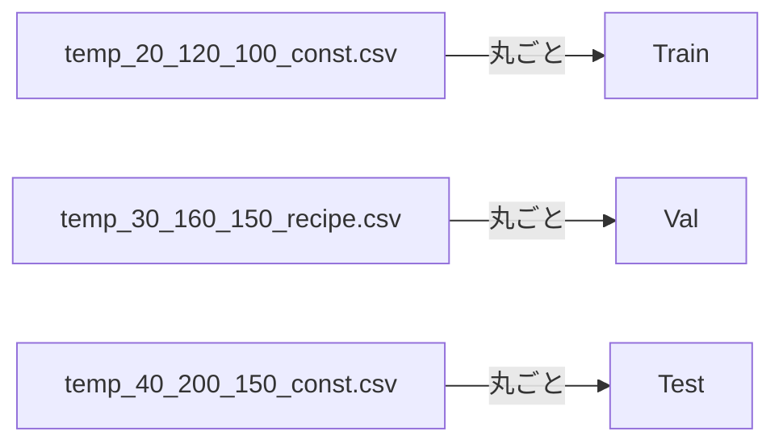

これにより、同一CAE曲線由来のリークを避ける。

### 3.2 one-step精度とrollout精度の乖離

one-step学習では、教師データの正しい \(\mathbf{T}_t\) を使って \(\mathbf{T}_{t+1}\) を予測する。一方、実利用では予測温度を次ステップ入力に戻すため、誤差が蓄積する。

本コードでは、以下を導入している。

- rollout評価
- endpoint error
- max abs error
- optional rollout loss

rollout lossは、短い未来区間について、予測を入力に戻しながら誤差を測る。

$$
\mathcal{L}_{rollout}
= \sum_{h=1}^{H}
\left\|
\widehat{\mathbf{T}}_{t+h} - \mathbf{T}_{t+h}
\right\|_2^2
$$

### 3.3 ブラックボックス化と物理解釈性

MLPやLSTMだけでは、なぜCenterとedgeが異なる温度勾配になるのか、どの熱接続が支配的なのかを説明しにくい。

本コードでは、`thermal_state_space` と `graph_rc` を主力としている。

- `thermal_state_space`: 平衡温度と減衰を分離
- `graph_rc`: Cell node/edge表と熱抵抗priorを使う

これにより、予測精度だけでなく、熱設計者が読める診断CSVを出力する。

### 3.4 実測ログでの機差・センサー差

CAE surrogateと実測は完全には一致しない。センサー取付差、校正差、装置個体差、壁面状態、slow drift、ノイズが残る。

本コードでは、CAE surrogateを実測で直接上書き学習せず、弱いpost-hoc補正だけを行う。

$$
T^{final}_{i,t}
= T^{base}_{i,t} + d_{i,t}
$$

初期製品範囲では、補正は以下に限定している。

- センサー別offset
- EMA slow bias

これは、コンピュータモデル較正で扱われるmodel discrepancyの考え方に近いが、フルベイズ較正や柔軟なGP discrepancyはあえて採用しない。自由すぎるdiscrepancyは、CAEモデルの意味を弱める可能性があるためである [R4][R5]。

---

## 4. 全体ワークフロー

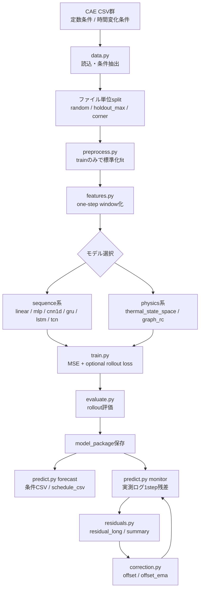

---

## 5. コード設計

### 5.1 ファイル責務

| ファイル | 主な役割 |
|---|---|
| `config.py` | YAML読込、CLI override、path解決 |
| `data.py` | CSV読込、条件抽出、ヘッダー有無対応、trajectory分割 |
| `preprocess.py` | 温度、ΔT、操作量の標準化、学習範囲保存 |
| `control.py` | schedule補間、実測ログresample、effective control |
| `features.py` | one-step学習window、future sequence作成 |
| `models_base.py` | 共通モデル仕様 `ModelSpec` と基底クラス |
| `models_sequence.py` | `linear_rc`, `mlp`, `cnn1d`, `gru`, `lstm`, `tcn` |
| `models_physics.py` | `thermal_state_space`, `graph_rc` |
| `models.py` | モデルregistry、`build_model` |
| `thermal_graph.py` | `cell_nodes.csv`, `cell_edges.csv` からGraph-RC prior生成 |
| `train.py` | 学習、early stopping、rollout評価、model_package保存 |
| `evaluate.py` | rollout評価、case別指標 |
| `predict.py` | forecast / monitor、OOD警告、弱補正適用 |
| `correction.py` | offset / EMA corrector、residual long変換 |
| `residuals.py` | monitor出力から residual table と補正artifact作成 |
| `compare.py` | 複数runのleaderboard作成 |
| `plots.py` | loss, rollout, error, graph heatmapなどの可視化 |

### 5.2 設計思想

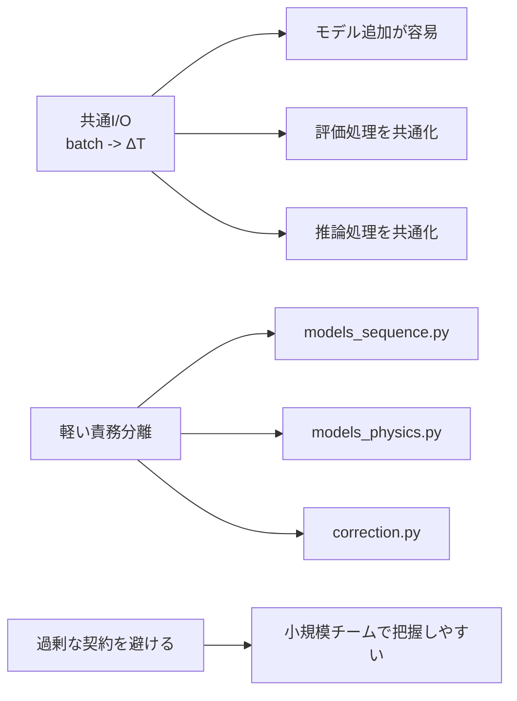

すべての学習モデルは、以下を満たす。

```python
batch -> standardized ΔT [B, N]
```

これにより、モデル固有のDataLoaderやpredict処理を作らなくて済む。

---

## 6. 前処理と特徴量

### 6.1 標準化

温度 \(T\)、温度差 \(\Delta T\)、操作量 \(u\) はtrainデータのみでfitし、val/test/predにはtransformのみを行う。

$$
z = \frac{x - \mu_{train}}{\sigma_{train} + \epsilon}
$$

これにより、val/test情報が前処理に漏れることを避ける。

### 6.2 one-step window

履歴長を \(K\) とすると、1サンプルは以下である。

$$
\left(
\mathbf{T}_{t-K+1:t},
\mathbf{u}_{t-K+1:t},
\mathbf{u}_{t+1}
\right)
\rightarrow
\Delta \mathbf{T}_{t+1}
$$

コード上のbatch keyは以下である。

| key | shape | 意味 |
|---|---:|---|
| `state_hist` | `[B, K, N]` | 温度履歴 |
| `control_hist` | `[B, K, C]` | 操作量履歴 |
| `control_next` | `[B, C]` | 次時刻操作量 |
| `target_delta` | `[B, N]` | 教師ΔT |
| `future_temps` | `[B, H, N]` | rollout loss用未来温度 |
| `future_controls` | `[B, H, C]` | rollout loss用未来操作量 |

### 6.3 effective control

ヒーターやブラインは、設定値が変わっても実効入熱・実効冷却が即座には変わらない。この遅れを一次遅れで近似する。

$$
\mathbf{u}^{eff}_{k}
=
\mathbf{u}^{eff}_{k-1}
+
\alpha_k
(\mathbf{u}_{k} - \mathbf{u}^{eff}_{k-1})
$$

$$
\alpha_k = 1 - \exp\left(-\frac{\Delta t_k}{\tau}\right)
$$

`features.use_effective_controls=true` のとき、学習・評価・推論で同じ変換を使う。

---

## 7. モデル手法の詳細

## 7.1 sequence系モデル

### 7.1.1 Linear RC baseline

$$
\Delta \mathbf{T}_{t+1}
= W [\mathbf{T}_{t}, \mathbf{u}_{t+1}] + \mathbf{b}
$$

最小限の基準モデルである。これに勝てない深層モデルは、データ分割、特徴量、過学習、標準化に問題がある可能性がある。

### 7.1.2 MLP

履歴温度・履歴操作量をflattenしてMLPに入力する。

$$
\Delta \mathbf{T}_{t+1}
= \mathrm{MLP}\left(
\mathrm{vec}(\mathbf{T}_{t-K+1:t}, \mathbf{u}_{t-K+1:t}),
\mathbf{u}_{t+1}
\right)
$$

短い履歴では強いbaselineになるが、長い熱時定数の表現はGRU/TCNより弱くなる可能性がある。

### 7.1.3 CNN1D / TCN

1D-CNNやTCNは、温度・制御履歴を畳み込みで処理する。TCNに関する経験的評価では、単純な畳み込み系列モデルがLSTMなどの再帰型モデルに対して多様なタスクで強い性能と長い有効記憶を示すことが報告されている [R6]。

本コードのTCNは簡易dilated convolutionである。

$$
\mathbf{z}_t
= \mathrm{TCN}( [\mathbf{T}_{t-K+1:t},\mathbf{u}_{t-K+1:t}] )
$$

$$
\Delta \mathbf{T}_{t+1}
= \mathrm{Head}(\mathbf{z}_t, \mathbf{u}_{t+1})
$$

動的scheduleや制御履歴の影響を見る比較モデルとして有用である。

### 7.1.4 GRU / LSTM

GRU/LSTMは履歴列を再帰的にエンコードする。

$$
\mathbf{h}_t
= \mathrm{GRU}( [\mathbf{T}_{t-K+1:t}, \mathbf{u}_{t-K+1:t}] )
$$

$$
\Delta \mathbf{T}_{t+1}
= \mathrm{Head}(\mathbf{h}_t, \mathbf{u}_{t+1})
$$

今回の少数点問題では、GRU/TCNを優先し、LSTMは比較用に留める設計である。

---

## 7.2 physics系モデル

### 7.2.1 Thermal State Space

`thermal_state_space` は、平衡温度、減衰、非線形残差を分ける。

$$
\mathbf{T}_{eq} = g_\phi(\mathbf{u}_{t+1})
$$

$$
\mathbf{a} = \sigma_\psi(\mathbf{u}_{t+1}), \quad 0 \le a_i \le a_{max} < 1
$$

$$
\mathbf{T}_{t+1}
= \mathbf{T}_{eq}
+ \mathbf{a} \odot (\mathbf{T}_{t} - \mathbf{T}_{eq})
+ s_r r_\theta(\mathbf{T}_{t}, \mathbf{u}_{t+1})
$$

返す値は

$$
\Delta \mathbf{T}_{t+1}
= \mathbf{T}_{t+1} - \mathbf{T}_{t}
$$

である。

#### 有用性

| 観点 | 有用性 |
|---|---|
| 安定性 | \(a_i<1\) により、平衡温度へ向かう構造を持つ |
| 少数点 | 3点/4点でも自由度を抑えやすい |
| 解釈性 | \(T_{eq}\) と減衰を別々に見られる |
| CAE surrogate | ブラックボックスMLPより熱応答に近い |

### 7.2.2 Graph-RC

`graph_rc` は、計測点を熱ノード、熱抵抗表をエッジとして扱う。

`cell_nodes.csv` 例:

```csv
sensor,x_mm,y_mm,z_mm,thermal_mass,plasma_weight,heater_weight,brine_weight
CP,0,0,0,0.90,1.00,0.25,0.15
Center,0,0,25,1.10,0.75,0.85,0.25
middle,70,0,25,1.30,0.55,0.65,0.55
edge,140,0,25,1.55,0.35,0.45,0.90
```

`cell_edges.csv` 例:

```csv
src,dst,r_th_K_per_W,contact_type,note
CP,Center,0.75,vertical,plasma-side to upper center
Center,middle,0.50,radial,center to middle
middle,edge,0.60,radial,middle to edge
Center,edge,1.60,radial_long,weak long-range path
```

熱抵抗からconductance priorを作る。

$$
G^{prior}_{ij} = \frac{1}{R_{ij}}
$$

モデル式は、概念的には次である。

$$
\Delta T_i
=
 s_g \frac{\sum_j G_{ij}(T_j - T_i)}{M_i}
+ s_q \frac{q_i^{prior}(\mathbf{u})}{M_i}
+ q_i^{NN}(\mathbf{u})
+ s_r r_i(\mathbf{T},\mathbf{u})
$$

ここで

$$
q_i^{prior}(\mathbf{u})
= w_{i,plasma}u_{plasma}
+ w_{i,heater}u_{heater}
- w_{i,brine}u_{brine}
$$

である。

Graph-RCでは、学習したconductanceがpriorから大きく外れすぎないように、任意で以下の正則化を入れる。

$$
\mathcal{L}_{graph}
=
\frac{1}{|E|}
\sum_{(i,j)\in E}
\left(
\log G_{ij}^{learned}
-
\log G_{ij}^{prior}
\right)^2
$$

#### 有用性

| 観点 | 有用性 |
|---|---|
| 熱設計知識の活用 | 既知のCell位置関係・熱抵抗を直接使える |
| 診断性 | `learned_conductance.csv`, `graph_diagnostics.csv` で熱接続の変化を確認できる |
| 少数点対応 | 3点サブグラフでも動く |
| 過学習抑制 | 熱抵抗priorと小さいresidualで自由度を抑えられる |

グラフ上の時空間依存を扱う考え方は、交通流予測などで、空間依存をグラフ、時間依存を系列モデルで扱うDCRNNのような研究でも有効性が示されている [R7]。本コードは汎用GNNライブラリではなく、少数点熱ネットワークに限定した軽量Graph-RCとして実装している。

---

## 8. 実測モニタリングと残差解析

### 8.1 forecast と monitor の違い

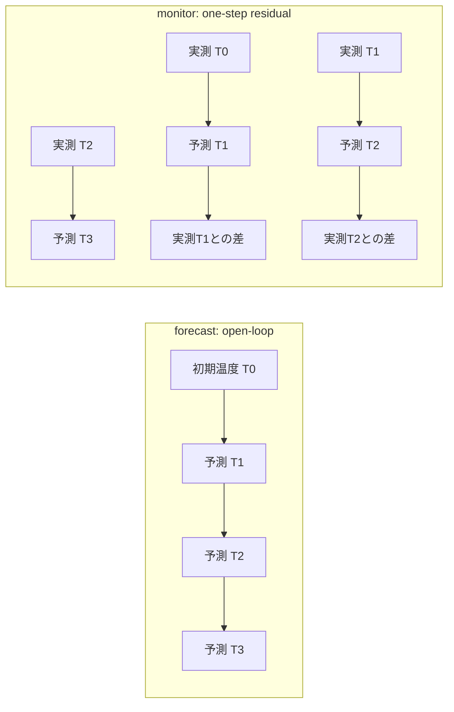

forecastは新条件の温度時系列を予測する。monitorは実測ログを使い、各時刻の実測温度を状態として次時刻を1-step予測し、残差を監視する。

### 8.2 residual long形式

`celltemp residuals` は、monitor出力から以下のlong形式を作る。

| 列 | 意味 |
|---|---|
| `case_id` | ケースID |
| `time` | 時刻 |
| `sensor` | センサー名 |
| `T_meas` | 実測温度 |
| `T_base` | 補正前予測 |
| `T_final` | 補正後予測 |
| `residual_base` | `T_meas - T_base` |
| `residual_final` | `T_meas - T_final` |
| `abs_err_base` | 補正前絶対誤差 |
| `abs_err_final` | 補正後絶対誤差 |

これにより、3点でも4点でも同じ残差解析ができる。

### 8.3 弱補正

センサー別offsetは、残差中央値で推定する。

$$
b_i
= \mathrm{median}_{case,t}(T^{meas}_{i,t} - T^{base}_{i,t})
$$

補正後は

$$
T^{final}_{i,t}
= T^{base}_{i,t} + \mathrm{clip}(b_i, -d_{max}, d_{max})
$$

EMA slow biasは、monitor中にゆっくり更新する。

$$
b^{slow}_{i,t}
= (1-\alpha)b^{slow}_{i,t-1}
+ \alpha (T^{meas}_{i,t} - T^{base}_{i,t} - b_i)
$$

$$
T^{final}_{i,t}
= T^{base}_{i,t} + b_i + b^{slow}_{i,t}
$$

補正量は必ずclampする。

$$
|b_i + b^{slow}_{i,t}| \le d_{max}
$$

この制約により、補正がCAE surrogateを置き換えるほど強くなることを防ぐ。

---

## 9. ベンチマーク問題設定

### 9.1 TopCell-ICP-Thermal Benchmark v0

同梱ベンチマークは、半導体プラズマチャンバー上部Cellを想定した合成CAE風データである。実機や特定商用装置を再現したものではなく、コード機能評価用の物理風データである。

| 項目 | 内容 |
|---|---|
| センサー | `CP`, `Center`, `middle`, `edge` |
| 操作量 | `brine`, `heater`, `plasma` |
| 時間 | 0〜180 s |
| dt | 1.0 s |
| 定数条件 | 192 trajectories |
| 動的条件 | 16 trajectories |
| 合計 | 208 trajectories |
| 初期温度pattern | `cold`, `nominal`, `gradient` |
| 動的scenario | `step_plasma`, `step_heater`, `step_brine`, `recipe` |

定数条件は、以下の格子で生成される。

| 因子 | 水準 |
|---|---|
| `brine` | 10, 20, 30, 40 |
| `heater` | 80, 120, 160, 200 |
| `plasma` | 0, 50, 100, 150 |
| initial pattern | `cold`, `nominal`, `gradient` |

したがって、定数条件は \(4 \times 4 \times 4 \times 3 = 192\) trajectoriesである。動的条件は、代表4条件に対して4種類のscheduleを与えるため \(4 \times 4 = 16\) trajectoriesである。疑似実測monitorは、`recipe` と `step_plasma` を元にした2本のログとして作られる。

### 9.2 データ生成の熱モデル

ベンチマークは、以下の熱RCネットワークを元に生成されている。

$$
C_i\frac{dT_i}{dt}
= \sum_j G_{ij}(T_j-T_i)
+ w_{i,p}p(t)
+ w_{i,h}h(t)
- w_{i,b}b(t)
- k_i(T_i-T_{amb})
$$

実際の生成スクリプトでは、操作量そのものではなく、一次遅れを通した有効操作量を真値生成に使う。

| 操作量 | 真値生成側の一次遅れ |
|---|---:|
| `brine` | 4.0 s |
| `heater` | 8.0 s |
| `plasma` | 1.0 s |

また、ブライン冷却は単純な線形sinkではなく、

$$
T_{sink}(b) = 55.0 - 0.45 b
$$

を使い、\((T_{sink}(b)-T_i)\) に比例する冷却として実装されている。学習器はこの生成式を直接知らない。CSV時系列、ファイル名またはCSV内の操作量、Graph-RC用のnode/edge表だけを使う。

単一または複数の熱容量・熱抵抗で過渡伝熱を近似する考え方は、lumped capacitance / lumped element model と対応する。lumped capacitanceは、対象領域内の温度分布を代表温度で近似し、熱容量と熱抵抗で過渡応答を扱う近似である [R8]。Biot数が十分小さい領域ではこの近似が有効であり、複雑形状では複数ノードに分けることで代表点ネットワークとして扱える [R9]。

### 9.3 ベンチマークで評価する課題

| Task | 目的 | 推奨モデル |
|---|---|---|
| A. 標準split | 定数・動的trajectoryを含む基本rollout性能 | 全モデル |
| B. 高plasma外挿 | 条件境界での安定性 | `graph_rc`, `thermal_state_space`, sequence系 |
| C. 動的schedule | 時間変化入力への応答 | `gru`, `lstm`, `tcn`, `graph_rc + effective control` |
| D. 3点/4点 | 少数計測点対応 | 小型`graph_rc`, 小型`thermal_state_space` |
| E. monitor | 実測風ログのone-step残差 | 任意のbase model |
| F. residuals | offset / slow bias解析 | `residuals`, `correction` |

本ベンチマークの狙いは、単に最小RMSEのモデルを選ぶことだけではない。標準splitではCAE surrogateの純粋な逐次予測性能を見て、高plasma外挿では条件境界での振る舞いを見て、3点評価では計測点削減時の劣化を見て、monitor/residualsでは実測ログに近い誤差構造を確認する。Graph-RCは、この中で「精度競争の候補」であると同時に、「熱抵抗表と入熱/冷却重みが破綻していないかを見る診断器」として扱う。

---

## 10. ベンチマーク実行ワークフロー

以下のコマンド例は、`topcell_benchmark_v0` を作業ディレクトリにして実行する想定である。リポジトリrootから実行する場合は、config pathを `topcell_benchmark_v0/configs/...` に置き換える。

### 10.1 学習

```bash
celltemp train --config configs/config_train.yaml \
  model.name=graph_rc \
  project.run_name=bench_graph_rc_topcell_v0
```

比較モデル:

```bash
celltemp train --config configs/config_train.yaml model.name=thermal_state_space project.run_name=bench_tss_topcell_v0
celltemp train --config configs/config_train.yaml model.name=tcn project.run_name=bench_tcn_topcell_v0
celltemp train --config configs/config_train.yaml model.name=gru project.run_name=bench_gru_topcell_v0
celltemp train --config configs/config_train.yaml model.name=lstm project.run_name=bench_lstm_topcell_v0
```

本レポートの実行では、上記に加えて `linear_rc`, `mlp`, `cnn1d` も同一workflowで学習した。また、Graph-RCについては高plasma外挿用の `config_train_holdout_plasma.yaml` と3点センサー用の `config_train_3pt.yaml` も実行した。

### 10.2 比較

```bash
celltemp compare --config configs/config_train.yaml
```

主な出力:

```text
outputs/model_leaderboard.csv
```

### 10.3 forecast

```bash
celltemp predict --config configs/config_pred.yml \
  model_package.path=outputs/runs/bench_graph_rc_topcell_v0/model_package \
  prediction.mode=forecast
```

### 10.4 monitor と residuals

```bash
celltemp predict --config configs/config_pred.yml \
  model_package.path=outputs/runs/bench_graph_rc_topcell_v0/model_package \
  prediction.mode=monitor \
  prediction.input_table=data/pred/monitor_cases.csv \
  prediction.output_dir=outputs/monitor_graph_rc

celltemp residuals --config configs/config_pred.yml \
  residuals.input_dir=outputs/monitor_graph_rc \
  residuals.output_dir=outputs/residual_analysis
```

### 10.5 offset_ema補正つきmonitor

```bash
celltemp predict --config configs/config_pred.yml \
  model_package.path=outputs/runs/bench_graph_rc_topcell_v0/model_package \
  prediction.mode=monitor \
  prediction.input_table=data/pred/monitor_cases.csv \
  prediction.output_dir=outputs/monitor_graph_rc_corrected \
  prediction.correction.enabled=true \
  prediction.correction.mode=offset_ema \
  prediction.correction.artifact=outputs/residual_analysis/offset_correction.json
```

---

## 11. 評価指標と見方

### 11.1 温度予測指標

$$
MAE = \frac{1}{TN}\sum_{t=1}^{T}\sum_{i=1}^{N}
|\widehat{T}_{i,t}-T_{i,t}|
$$

$$
RMSE =
\sqrt{\frac{1}{TN}\sum_{t=1}^{T}\sum_{i=1}^{N}
(\widehat{T}_{i,t}-T_{i,t})^2}
$$

$$
E_{endpoint} = \frac{1}{N}\sum_{i=1}^{N}
|\widehat{T}_{i,T}-T_{i,T}|
$$

| 指標 | 用途 |
|---|---|
| `rollout_rmse` | 実推論に近い逐次予測性能 |
| `endpoint_mae` | 最終温度のズレ |
| `max_abs_error` | 最大逸脱・安全側評価 |
| `per_sensor_mae` | センサー別弱点の確認 |
| `dynamic case error` | step/ramp/recipeでの性能確認 |

### 11.2 Graph-RC診断

| 出力 | 意味 |
|---|---|
| `learned_conductance.csv` | 学習後の熱接続強度 |
| `graph_diagnostics.csv` | priorとlearnedの比率 |
| `source_weight.csv` | 入熱/冷却重み |
| `graph_conductance_prior.png` | 初期prior可視化 |
| `graph_conductance_learned.png` | 学習後可視化 |

判定目安:

| learned/prior ratio | 解釈 |
|---:|---|
| `< 0.1` | そのedgeが過大prior、または不要な可能性 |
| `0.1〜10` | 大きな破綻なし |
| `> 10` | 熱抵抗表、CAE条件、またはモデル設定の見直し候補 |

### 11.3 残差補正指標

$$
\mathrm{correction\ ratio}
= \frac{\mathrm{mean}(|d_{i,t}|)}{\mathrm{mean}(|T^{base}_{i,t}-T_{init,i}|)}
$$

| 指標 | 見方 |
|---|---|
| `mae_base` | 補正前のCAE surrogate性能 |
| `mae_final` | 補正後性能 |
| `mean_abs_correction` | 補正の平均大きさ |
| `max_abs_correction` | 補正の最大大きさ |
| `correction_to_signal_ratio` | 補正が強すぎないか |

望ましい状態は、補正量が小さいまま `mae_final < mae_base` になることである。

---

## 12. ベンチマーク実行結果と評価

本節では、`topcell_benchmark_v0` のデータと設定を使って、v6コードの実行結果を整理する。評価は、`topcell_benchmark_v0` をプロジェクトrootとして実行した。学習・推論・residuals・compareはすべて完走した。集計図と追加CSVは以下に保存した。

```text
topcell_benchmark_v0/outputs/benchmark_report/
```

### 12.1 標準splitでのモデル比較

標準splitでは、定数条件と動的条件を含む208 trajectoriesをtrajectory単位で train / val / test に分割し、各モデルを同じ `history_steps=8`、`use_effective_controls=true` の条件で比較した。

| model | test rollout MAE | test rollout RMSE | test max abs error | endpoint MAE |
|---|---:|---:|---:|---:|
| `lstm` | 0.271 | 0.335 | 1.031 | 0.251 |
| `gru` | 0.392 | 0.488 | 1.084 | 0.397 |
| `cnn1d` | 0.454 | 0.569 | 1.186 | 0.448 |
| `thermal_state_space` | 0.494 | 0.653 | 1.775 | 0.281 |
| `mlp` | 0.625 | 0.763 | 1.671 | 0.699 |
| `tcn` | 0.714 | 0.877 | 1.834 | 0.831 |
| `linear_rc` | 0.949 | 1.243 | 2.968 | 0.823 |
| `graph_rc` | 1.770 | 2.171 | 3.999 | 1.812 |

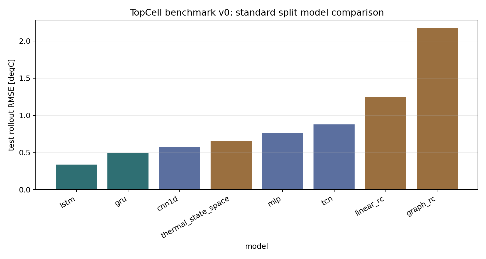

今回の標準splitでは、LSTMが最良であり、GRU、CNN1Dが続いた。`thermal_state_space` は物理寄りモデルとしては比較的安定しているが、最良の系列モデルには届かなかった。一方、Graph-RCは熱抵抗priorを使う説明可能なモデルであるにもかかわらず、RMSEでは最下位となった。

この結果は、レポート前半の設計意図をそのまま否定するものではない。むしろ、以下の切り分けを示している。

- 精度最優先のCAE surrogateとしては、現時点ではLSTM/GRUを優先する。
- Graph-RCは、熱抵抗表、ノード定義、入熱/冷却重みの診断に価値がある。
- Graph-RCを主力予測器にするには、標準化後の \(\Delta T\) へ物理項を直接足す現在の実装を見直し、物理温度空間でRC項・ambient loss・source項を計算する改善が必要である。

### 12.2 動的caseでの誤差傾向

標準splitのtestを `constant_or_unknown` と `dynamic` に分けると、動的caseでは多くのモデルでRMSEが相対的に小さくなった。

| model | constant RMSE | dynamic RMSE |
|---|---:|---:|
| `lstm` | 0.340 | 0.169 |
| `gru` | 0.495 | 0.269 |
| `cnn1d` | 0.575 | 0.383 |
| `thermal_state_space` | 0.663 | 0.350 |
| `mlp` | 0.771 | 0.502 |
| `tcn` | 0.884 | 0.672 |
| `linear_rc` | 1.265 | 0.582 |
| `graph_rc` | 2.206 | 1.142 |

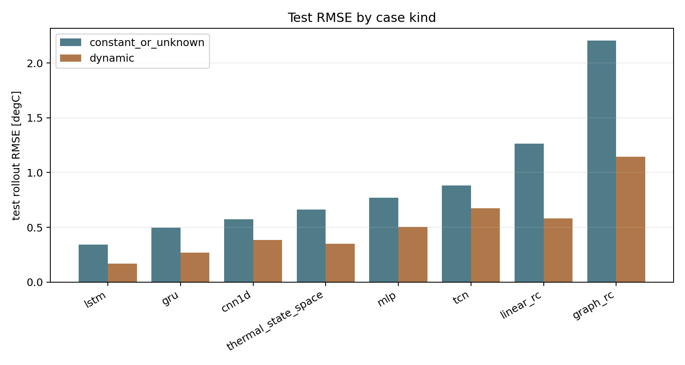

動的caseは16 trajectoriesと少なく、代表条件も限定されているため、この結果だけで「動的recipe全般に強い」とは判断しない。むしろ、動的caseが少数であることを明示し、recipe設計に使う前には追加のholdout設計が必要である。

### 12.3 Graph-RCの外挿・3点評価

Graph-RCについて、標準4点、plasma holdout、3点センサーの追加タスクを比較した。

| Graph-RC task | test rollout RMSE | max abs error | endpoint MAE |
|---|---:|---:|---:|
| 4点 random | 2.171 | 3.999 | 1.812 |
| 高plasma holdout | 2.301 | 4.420 | 1.880 |
| 3点 random | 1.938 | 3.163 | 1.735 |

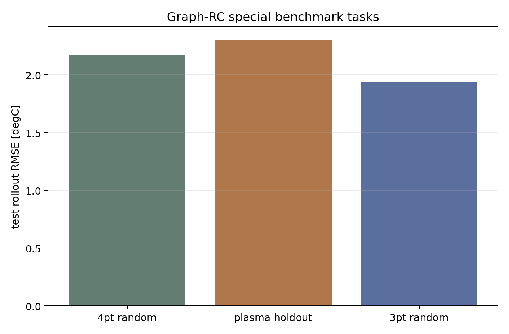

高plasma holdoutでは、標準splitよりRMSEが悪化した。これは条件境界での外挿リスクを示す。3点評価ではRMSEが4点Graph-RCより低く見えるが、対象センサーが `Center`, `middle`, `edge` の3点に変わっており、CPを含まないため単純な優劣比較ではない。3点対応そのものは動作するが、採用判断ではセンサー別の物理的重要度を別途確認する必要がある。

### 12.4 Graph-RC conductance診断

Graph-RCの学習後conductanceは、priorから大きく逸脱していない。

| edge | learned/prior |
|---|---:|
| Center->CP | 1.226 |
| CP->Center | 0.974 |
| middle->Center | 1.040 |
| edge->Center | 1.029 |
| Center->middle | 1.048 |
| edge->middle | 0.972 |
| Center->edge | 1.108 |
| middle->edge | 1.160 |

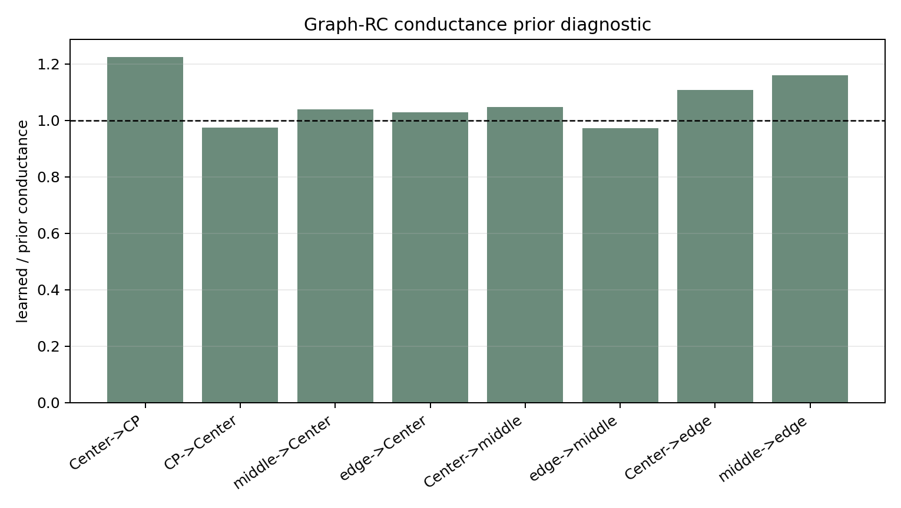

すべての learned/prior ratio は 0.1〜10 の範囲内であり、熱抵抗表が極端に破綻している兆候はない。したがって、Graph-RCの精度不足は、edge priorの異常というより、現行のGraph-RCモデル式と標準化空間での物理項扱いに起因する可能性が高い。

### 12.5 Forecast評価

Graph-RC model packageを使い、`conditions.csv` の3ケースをforecastし、対応するraw truth trajectoryと比較した。

| forecast case | 対応truth | MAE | RMSE | max abs error | endpoint MAE |
|---|---|---:|---:|---:|---:|
| `forecast_const_nominal` | `temp_20_120_100_const_nominal.csv` | 0.554 | 0.658 | 1.468 | 0.509 |
| `forecast_plasma_onoff` | `temp_20_120_100_step_plasma.csv` | 0.991 | 1.471 | 5.182 | 1.931 |
| `forecast_recipe` | `temp_30_160_150_recipe.csv` | 2.628 | 3.124 | 5.746 | 1.570 |

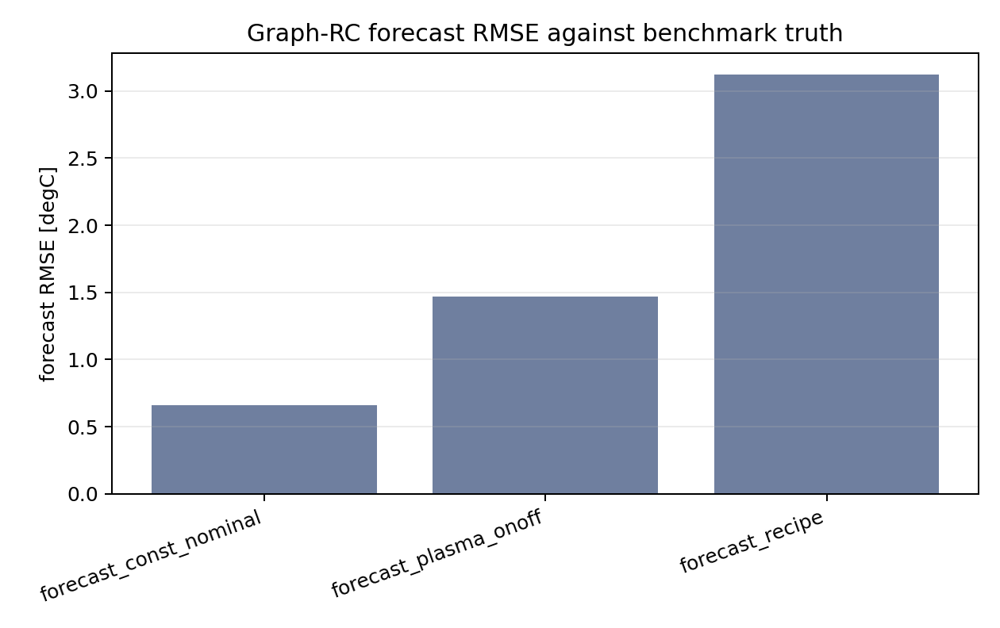

特に `forecast_recipe` では誤差が大きい。可視化では、CP/Center側は低め、edge側は高めに予測する系統誤差が見える。

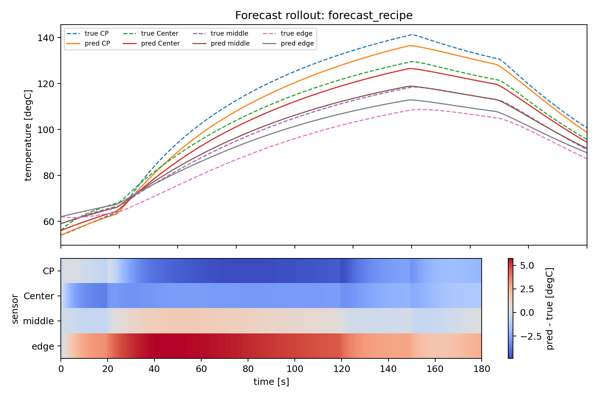

この結果から、Graph-RCをそのまま新規recipeのopen-loop forecastに使うのはリスクがある。実運用でforecastを使う場合は、現時点ではLSTM/GRUなど標準splitで強かった系列モデルを候補にし、Graph-RCは診断・説明用に併用するのが妥当である。

### 12.6 Monitor / residuals / 弱補正評価

疑似実測monitorは、真値trajectoryにセンサーoffset、tool bias、slow drift、Gaussian noiseを加えた2ログである。Graph-RCのmonitor結果は以下であった。

| case | base residual RMSE | offset_ema residual RMSE | mean abs correction |
|---|---:|---:|---:|
| `monitor_recipe_toolA` | 0.224 | 0.225 | 0.032 |
| `monitor_plasma_onoff_toolB` | 0.206 | 0.208 | 0.019 |
| 平均 | 0.215 | 0.216 | 0.026 |

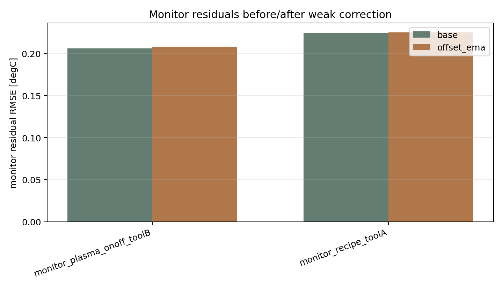

今回のoffset_ema補正は改善しなかった。残差中央値はセンサーごとに小さく、固定offsetとしては CP=0.013、Center=0.021、middle=-0.001、edge=-0.017 程度であった。そのため、弱補正を入れてもノイズや時刻依存の残差を十分に減らせず、RMSEはわずかに悪化した。

これは、補正機構の意義がないという意味ではない。むしろ、本コードが補正前後を分けて出力することにより、「補正が効いていない」「固定offsetではなく時刻・条件依存の残差が支配的かもしれない」と判断できることが重要である。製品運用では、補正後だけを見るのではなく、base residual、correction量、case別残差を必ず併記すべきである。

### 12.7 総合評価

今回のベンチマークから、以下の判断になる。

| 観点 | 評価 |
|---|---|
| 実行可能性 | 学習、比較、forecast、monitor、residuals、補正つきmonitorは完走した |
| 精度最優先モデル | 標準splitではLSTMが最良、GRUが次点 |
| 物理寄りモデル | `thermal_state_space` は中位、Graph-RCは精度不足 |
| Graph-RC診断 | conductance ratioは健全で、熱抵抗表の極端な破綻は見えない |
| 外挿耐性 | 高plasma holdoutではGraph-RC RMSEが悪化し、境界条件での注意が必要 |
| forecast | Graph-RCではrecipe forecastの誤差が大きく、主力forecastにはまだ不十分 |
| monitor補正 | 弱補正は今回改善せず、残差構造の診断用途として見るべき |

したがって、現時点の製品候補としては、LSTM/GRUを主力CAE surrogate候補、Graph-RCを熱設計知識の診断・説明補助、monitor/residualsを実測ログ監視と補正可否判断の基盤として扱うのが適切である。

Graph-RCを主力予測器へ近づけるには、次の改善が優先である。

1. Graph-RCのconduction/source/ambient項を物理温度空間で計算し、最後に標準化ΔTへ変換する。
2. 生成式に含まれるambient lossとブラインsink温度依存を明示的にモデルへ入れる。
3. `rollout_loss_weight` を使い、one-step lossだけでなく長期rollout誤差を直接抑える。
4. forecastのrecipe truth比較を標準評価に組み込み、モデル選定を `test_rollout_rmse` だけに依存しない。

---

## 13. 想定効果

### 13.1 従来課題に対する効果

| 従来課題 | 期待される効果 |
|---|---|
| 条件ごとにCAE計算が必要 | 学習済みmodel_packageで新条件を高速rollout予測できる |
| ブラックボックスモデルの説明性不足 | Graph-RCで熱抵抗prior、学習後conductanceを確認できる |
| 条件外で過信しやすい | OOD範囲警告、高plasma holdout評価、max error評価を持つ |
| 3点/4点など少数点でモデルが過剰 | 小型状態空間モデル、小型Graph-RC、3点サブグラフを使える |
| 実測ログとの差分が混ざって原因不明 | monitor residualをlong形式で整理し、sensor/時間/control別に解析できる |
| 実測補正が強くなりCAEの意味を失う | offset/EMAに限定し、補正前後を出力し、補正量をclampする |
| モデル追加でコードが肥大化 | sequence系、physics系、correction系に軽く責務分離している |

### 13.2 期待される技術的効果

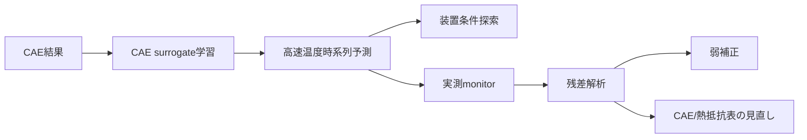

本コードは、単に精度の高い機械学習モデルを作るためではなく、CAE、熱設計、実測monitor、残差解析をつなぐ軽量な作業基盤として有用である。

---

## 14. 独自性・設計上の特徴

### 14.1 過度なMLOpsではなく、目的特化の軽量製品候補

Hydra、MLflow、DVC、PyTorch Lightningなどは入れていない。これは不足ではなく、意図的な設計である。小規模チームがコード全体を把握し、CAE・熱設計・データサイエンスを素早く回すには、まず軽量なCLIとYAML overrideで十分である。

### 14.2 CAE surrogateと実測補正の責務分離

実測補正は、主モデルを置き換えない。

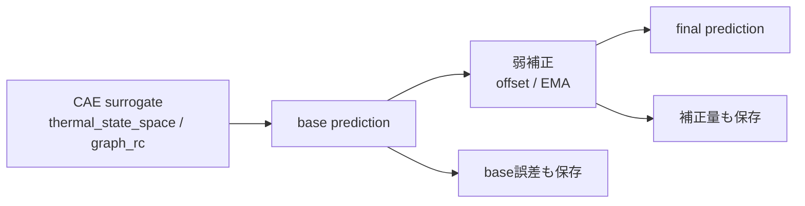

この設計により、補正後だけが良く見えて、CAE surrogate本体の品質が見えなくなることを避ける。

### 14.3 Graph-RCによる熱設計知識の利用

汎用GNNではなく、少数点熱ネットワークに限定している。これにより、依存ライブラリを増やさず、`cell_nodes.csv` と `cell_edges.csv` だけで熱設計知識を入れられる。

---

## 15. データサイエンティスト向けレビュー観点

### 15.1 最初に見るべき成果物

| 成果物 | 見る理由 |
|---|---|
| `train_history.csv` | 学習過程、過学習確認 |
| `rollout_summary.csv` | 実推論性能 |
| `rollout_by_case.csv` | 苦手ケース特定 |
| `model_leaderboard.csv` | 複数モデル比較 |
| `residual_summary.csv` | 実測残差の構造把握 |
| `offset_correction.json` | センサーoffset候補 |

### 15.2 モデル選定基準

1. one-step lossではなく、rollout RMSEを優先する。
2. endpoint errorとmax abs errorを見る。
3. 動的schedule caseでの誤差を見る。
4. Graph-RCならlearned/prior conductance比を見る。
5. monitor residualで、誤差がoffset / slow drift / 条件依存のどれかを見る。
6. 補正後性能だけでなく、補正前base性能を必ず見る。

---

## 16. コード開発者向け拡張ガイド

### 16.1 新しいsequenceモデルを追加する場合

1. `src/celltemp/models_sequence.py` にクラスを追加する。
2. `BaseCellTempModel` を継承する。
3. `forward(batch)` は標準化済み \(\Delta T\) `[B, N]` を返す。
4. `src/celltemp/models.py` の `MODELS` に登録する。

```python
class MySequenceModel(BaseCellTempModel):
    family = "sequence"
    def __init__(self, spec: ModelSpec):
        super().__init__()
        ...
    def forward(self, batch):
        return delta_scaled
```

### 16.2 新しい物理寄りモデルを追加する場合

1. `src/celltemp/models_physics.py` に追加する。
2. 可能なら熱的な安定化、非負係数、prior正則化を持たせる。
3. Graph-RCやthermal_state_spaceと同じbatch I/Oにする。

### 16.3 残差補正を追加する場合

最初に `residual_long.csv` と `residual_summary.csv` で残差構造を確認する。条件依存が明確に見えた場合だけ、Ridge / Huber residualを検討する。

Huber lossは小さい残差では二乗誤差、大きい残差では線形ペナルティとなり、外れ値に対して二乗誤差より頑健である [R10]。Ridge回帰はL2正則化で係数を抑制するため、残差補正を強くしすぎたくない場合に扱いやすい [R11]。

### 16.4 入れない方がよい拡張

| 拡張 | 現段階で避ける理由 |
|---|---|
| Neural ODE | 固定dt・少数点のΔT更新には重すぎる |
| PINN | PDE境界条件・場データが不足している |
| DeepONet / FNO | 任意位置温度場やメッシュ場を学習する段階ではない |
| 高自由度MLP residual | 実測補正がCAE surrogateを置き換える危険がある |
| モデル別DataLoader | 共通評価・共通推論が壊れる |

---

## 17. 参考文献

[R1] Plasma etching overview. 表面温度、吸着、脱離、揮発性生成物などがプラズマエッチングに関係することの概説。  
https://en.wikipedia.org/wiki/Plasma_etching

[R2] J. Upadhyay et al., *Etching Mechanism of Niobium in Coaxial Ar/Cl2 RF Plasma*, arXiv:1411.0176. RF power、圧力、温度、位置などがエッチング均一性に関係する例。  
https://arxiv.org/abs/1411.0176

[R3] Hyunwoo Kim et al., *Wafer-Level Etch Spatial Profiling for Process Monitoring from Time-Series with Time-LLM*, arXiv:2603.23576. 多チャンネル時系列からウェーハレベル空間分布を予測する近年例。  
https://arxiv.org/abs/2603.23576

[R4] M. C. Kennedy and A. O'Hagan, *Bayesian calibration of computer models*, Journal of the Royal Statistical Society Series B, 2001. コンピュータモデル較正とdiscrepancyの古典的枠組み。

[R5] Rui Tuo and C. F. Jeff Wu, *Efficient Calibration for Imperfect Computer Models*, arXiv:1507.07280. Kennedy-O'Hagan型較正の課題と代替較正の議論。  
https://arxiv.org/abs/1507.07280

[R6] Shaojie Bai, J. Zico Kolter, Vladlen Koltun, *An Empirical Evaluation of Generic Convolutional and Recurrent Networks for Sequence Modeling*, arXiv:1803.01271. TCNが系列モデリングで有効であることの経験的評価。  
https://arxiv.org/abs/1803.01271

[R7] Yaguang Li et al., *Diffusion Convolutional Recurrent Neural Network: Data-Driven Traffic Forecasting*, arXiv:1707.01926. グラフ上の空間依存と系列依存を組み合わせる時空間予測例。  
https://arxiv.org/abs/1707.01926

[R8] Lumped-element model / lumped-capacitance thermal systems. 熱容量・熱抵抗による過渡伝熱近似。  
https://en.wikipedia.org/wiki/Lumped-element_model

[R9] Biot number. Lumped approximationの妥当性判断に使う無次元数。  
https://en.wikipedia.org/wiki/Biot_number

[R10] Huber loss. 外れ値に頑健な損失関数。  
https://en.wikipedia.org/wiki/Huber_loss

[R11] Ridge regression. L2正則化付き線形回帰。  
https://en.wikipedia.org/wiki/Ridge_regression

[R12] H. Wang et al., *Isotropic plasma-thermal atomic layer etching of aluminum nitride using SF6 plasma and Al(CH3)3*, arXiv:2209.00150. plasma-thermal ALEで温度条件が重要になる例。  
https://arxiv.org/abs/2209.00150

---

## 18. まとめ

本コードは、半導体プラズマチャンバー上部Cellの少数計測点温度を、CAE過渡応答から学習し、新しい条件・時間変化schedule・実測monitorへ展開するための軽量な製品候補である。

設計上の価値は、以下にある。

1. CAE surrogateを主モデルとして保つ。
2. Graph-RCにより熱抵抗表・Cell位置関係を直接利用する。
3. データ駆動モデルと物理寄りモデルを同じ評価基盤で比較する。
4. forecastとmonitorを分け、実測残差を構造化する。
5. 補正はoffset / EMAに限定し、CAEの意味を壊さない。
6. 3点・4点など少数計測点でも同じコードで扱える。

このため、本コードは単なる温度予測モデルではなく、CAE、熱設計、データサイエンス、実測monitorをつなぐ解析・評価基盤として有用である。

ただし、今回の `TopCell-ICP-Thermal Benchmark v0` の実行結果では、精度面の主力候補はLSTM/GRUであり、Graph-RCはそのままでは主力予測器として不十分であった。Graph-RCは、熱抵抗表や入熱/冷却重みを診断する説明用モデルとして価値があり、今後は物理温度空間でのRC項計算、ambient loss、ブラインsink依存、rollout lossを組み込むことで、説明性と精度の両立を目指すのが次の開発課題である。
